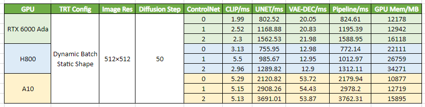

# Introduction

This demo application ("demoDiffusion") showcases the acceleration of Stable Diffusion pipeline using TensorRT.

# Setup

### Clone the TensorRT OSS repository

```bash
git clone git@github.com:NVIDIA/TensorRT.git -b release/8.6 --single-branch
cd TensorRT
```

### Launch TensorRT NGC container

Install nvidia-docker using [these intructions](https://docs.nvidia.com/datacenter/cloud-native/container-toolkit/install-guide.html#docker).

```bash
docker run --rm -it --gpus all -v $PWD:/workspace nvcr.io/nvidia/pytorch:23.02-py3 /bin/bash
```

### Install latest TensorRT release

```bash
python3 -m pip install --upgrade pip
python3 -m pip install --upgrade tensorrt
```

Minimum required version is TensorRT 8.6.0. Check your installed version using:
`python3 -c 'import tensorrt;print(tensorrt.__version__)'`

> NOTE: Alternatively, you can download and install TensorRT packages from [NVIDIA TensorRT Developer Zone](https://developer.nvidia.com/tensorrt).

### Install required packages

```bash
export TRT_OSSPATH=/workspace
cd $TRT_OSSPATH/demo/Diffusion
pip3 install -r requirements.txt

# Create output directories
mkdir -p onnx engine output
```

> NOTE: demoDiffusion has been tested on systems with NVIDIA A100, RTX3090, and RTX4090 GPUs, and the following software configuration.
```
diffusers           0.14.0
onnx                1.13.1
onnx-graphsurgeon   0.3.26
onnxruntime         1.14.1
polygraphy          0.44.2
tensorrt            8.6.0.10
tokenizers          0.13.2
torch               1.13.0
transformers        4.26.1
```

> NOTE: optionally install HuggingFace [accelerate](https://pypi.org/project/accelerate/) package for faster and less memory-intense model loading.


# Running demoDiffusion

### Review usage instructions for the supported pipelines

```bash
python3 demo_txt2img.py --help
python3 demo_img2img.py --help
python3 demo_inpaint.py --help
```

### HuggingFace user access token

To download the model checkpoints for the Stable Diffusion pipeline, you will need a `read` access token. See [instructions](https://huggingface.co/docs/hub/security-tokens).

```bash
export HF_TOKEN=<your access token>
```

### Generate an image guided by a single text prompt

```bash
python3 demo_txt2img.py "a beautiful photograph of Mt. Fuji during cherry blossom" --hf-token=$HF_TOKEN -v
```

### Generate an image guided by an image and single text prompt

```bash
python3 demo_img2img.py "photorealistic new zealand hills" --hf-token=$HF_TOKEN -v
```

Use `--input-image=<path to image>` to specify your image. Otherwise the example image will be downloaded from the Internet.

### Generate an inpainted image guided by an image, mask and single text prompt

```bash
# Create separate onnx/engine directories when switching versions
mkdir -p onnx-1.5 engine-1.5

python3 demo_inpaint.py "a mecha robot sitting on a bench" --hf-token=$HF_TOKEN --version=1.5 --onnx-dir=onnx-1.5 --engine-dir=engine-1.5 -v
```

Use `--input-image=<path to image>` and `--mask-image=<path to mask>` to specify your inputs. They must have the same dimensions. Otherwise the example image and mask will be downloaded from the Internet.

### Input arguments
- One can set schdeuler using `--scheduler=EulerA`. Note that some schedulers are not available for some pipelines or version.
- To accelerate engine building time one can use `--timing-cache=<path to cache file>`. This cache file will be created if does not exist. Note, that it may influence the performance if the cache file created on the other hardware is used. It is suggested to use this flag only during development. To achieve the best perfromance during deployment, please, build engines without timing cache.
- To switch between versions or pipelines one needs either to clear onnx and engine dirs, or to specify `--force-onnx-export --force-onnx-optimize --force-engine-build` or to create new dirs and to specify `--onnx-dir=<new onnx dir> --engine-dir=<new engine dir>`.
- Inference performance can be improved by enabling [CUDA graphs](https://docs.nvidia.com/cuda/cuda-c-programming-guide/index.html#cuda-graphs) using `--use-cuda-graph`. Enabling CUDA graphs requires fixed input shapes, so this flag must be combined with `--build-static-batch` and cannot be combined with `--build-dynamic-shape`.

# Stable Diffusion with ControlNet
We may need to clean the onnx and trt files in `onnx` and `engine` path or configure different paths for different experiments. 
```bash
rm -rf onnx/* engine/*
```
Environment software configuration:
```
controlnet-aux           0.0.6
cuda-python              12.1.0rc1+1.g9e30ea2.dirty
diffusers                0.17.1
huggingface-hub          0.15.1
nvidia-cublas-cu12       12.2.1.16
nvidia-cuda-runtime-cu12 12.2.53
nvidia-cudnn-cu12        8.9.2.26
nvidia-dali-cuda110      1.22.0
nvidia-pyindex           1.0.9
nvtx                     0.2.5
onnx                     1.13.0
onnx-graphsurgeon        0.3.27
onnxruntime              1.15.1
opencv-python            4.7.0.72
polygraphy               0.43.1
tensorrt                 8.6.1
tokenizers               0.13.3
torch                    1.14.0a0+44dac5
transformers             4.30.2
```  

### Without ControlNet
Just like `demo_txt2img.py` we can run text to image inference:
```bash
python3 demo_txt2img_controlnet.py "a beautiful photograph of Mt. Fuji during cherry blossom" --hf-token=$HF_TOKEN -v
```

### Single ControlNet
We can run SD + single Controlnet inference:
```bash
python3 demo_txt2img_controlnet.py --hf-token=$HF_TOKEN -v --controlnet-type=canny --controlnet-scale=1.0
```
Note:  
1. `--controlnet-type` currently can be choosen from `['canny', 'depth', 'hed', 'mlsd', 'normal', 'openpose', 'scribble', 'seg']`, but input image and prompt samples are only implemented for `canny` and `normal`. You need to modify the code if you want to implement other controlnet types, with reference to this demo. 
2. We can set the weight of controlnet by `--controlnet-scale`.

### Mutiple ControlNets
We can just set multiple controlnets for inference:
```bash
python3 demo_txt2img_controlnet.py --hf-token=$HF_TOKEN -v --controlnet-type canny normal --controlnet-scale 1.0 1.0
```

### Some inference performance data (For reference only)


### Dynamic batchsize and dynamic image shape
This demo enables dynamic batchsize by default. If you want to build static batchsize, you can add `--build-static-batch` to the cmd.  
And if you want to enable dynamic shape (e.g. to generate images of 256*256 to 1024*1024), you can add `--build-dynamic-shape` to the cmd. Like below:
```bash
python3 demo_txt2img_controlnet.py --hf-token=$HF_TOKEN -v --build-dynamic-shape --controlnet-type=canny --controlnet-scale=1.0
```
Then we can use the built engine to generate different resolution images:
```bash
python3 demo_txt2img_controlnet.py --hf-token=$HF_TOKEN -v --build-dynamic-shape --controlnet-type=canny --controlnet-scale=1.0 --height=1024 --width=1024
## --height=512 --width=512 or other resolution in [256, 1024] also works
```

### Acknowledgements
The controlnet implementation is inspired by [controlnet_stable_tensorrt](https://github.com/hnsywangxin/controlnet_stable_tensorrt), thanks for his good work.

### Known Issues

* Issue: `onnx_torch.ModelProto exceeded maximum protobuf size of 2GB: ` & `RuntimeError: The model does not have an ir_version set properly.`  
Solution: We have to replace python List with torch.nn.ModuleList() for mutiple layers representation, e.g. `[ControlNetModel]` ==> `torch.nn.ModuleList([ControlNetModel])`  
Ref: [Link1](https://discuss.pytorch.org/t/cannot-insert-a-tensor-that-requires-grad-as-a-constant/46561/7) [Link2](https://discuss.pytorch.org/t/the-difference-in-usage-between-nn-modulelist-and-python-list/7744/6) [Link3](https://discuss.pytorch.org/t/is-it-mandatory-to-add-modules-to-modulelist-to-access-its-parameters/81622)