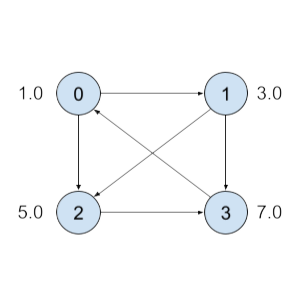

# Utilizing a plugin with aliased I/O to realize in-place updates

## Description

This sample, `aliased_io_plugin`, implements a Python-based plugin for an in-place scatter-add operation.

Scatter-add "scatters" a set of source values into memory locations based on a given set of indices and adds together those values mapped to the same location.

## How does this sample work?

This sample creates and runs a TensorRT engine demonstrating an example commonly encountered with Graph Neural Networks (GNNs). In GNNs, the features associated with the neighbors of each node is aggregated with an order-independent operation (e.g. sum, product), averaged by the size of the neighborhood, and then run through a classifier to determine a property of interest; example applications of GNNs include the modeling of social networks and building recommendation systems.

Here, we use an addition as the aggregation function; therefore, we build a network containing a Scatter-add plugin node. It receives a "source" tensor containing the features of the neighbors of each node, and an "index" tensor denoting the index of each such node. For example, consider the following graph:



For simplicity, in this example, and in the sample in general, we utilize scalar features at each node. The "source" could be represented as a flattened tensor `[1.0, 3.0, 5.0, 7.0, 1.0, 3.0]` while the corresponding source nodes are `[1, 2, 3, 0, 2, 3]`. It is clear that the Scatter-add should yield `[7.0, 1.0, 4.0, 8.0]`. This result is then normalized by the number of neighbors of each node and then fed into a simple dense layer followed by ReLU activation.

### Implementing an in-place Scatter-add plugin using `IPluginV3OneBuildV2` interface

Before the introduction of `IPluginV3OneBuildV2` interface, TensorRT plugin inputs were to be treated as read-only. In-place optimizations (output written to an input) and operations that inherently required an input to be modified, were kept out-of-reach due to this limitation.

In the Scatter-add operation, an in-place operation is useful because a node of interest may have some pre-conditions that require the neighborhood aggregation to be combined with a bias. Another use case is in hierarchical aggregation where higher-layer features may have to be integrated as well.

To allow writes to the input, `IPluginV3OneBuildV2` interface provides an API to declare certain input-output pairs as being aliased. In this case, the first output of the plugin and the first input are aliased, so we may declare:
```py
def get_aliased_input(self, output_index: int):
	if output_index == 0:
		return 0

	return -1
```
A return value of `-1` indicates that that `output_index` is not aliased to any input.

This new method `get_aliased_input` is the only difference between `IPluginV3OneBuildV2` and `IPluginV3OneBuild`. As part of the `V3_ONE` set of capability interfaces, `IPluginV3OneBuildV2` may be used in conjunction with `IPluginV3OneCore` and `IPluginV3OneRuntime`.

### Creating network and building the engine

To add the plugin to the network, the `INetworkDefinition::add_plugin_v3()` method is used.

For subsequent averaging and classification steps, TensorRT ElementWise, MatrixMultiply, Activation and SoftMax layers are used.

## Running the sample

1.  Run the sample to create a TensorRT inference engine and run inference:
    `python3 aliased_io_plugin.py [-h] [--precision {fp32,fp16}] [--node_features NODE_FEATURES] [--edges EDGES] [--num_classes NUM_CLASSES] [--validate] [--seed SEED]`

2.  If the `--validate` flag was passed, verify that the sample ran successfully. If the sample runs successfully, you should see the following message:
     ```
    Validation against reference successful!
    ```

### Sample `--help` options

To see the full list of available options and their descriptions, use the `-h` or `--help` command line option.


# Additional resources

The following resources provide a deeper understanding about the V3 TensorRT plugins and the Scatter-Add operation:

**ScatterElements**
- [ONNX: ScatterElements](https://onnx.ai/onnx/operators/onnx__ScatterElements.html)

**TensorRT plugins**
- [Extending TensorRT with Custom Layers](https://docs.nvidia.com/deeplearning/tensorrt/developer-guide/index.html#extending)
- [TensorRT Python-based Plugins](https://docs.nvidia.com/deeplearning/tensorrt/developer-guide/#add_custom_layer_python)

**Other documentation**
- [Introduction To NVIDIA’s TensorRT Samples](https://docs.nvidia.com/deeplearning/sdk/tensorrt-sample-support-guide/index.html#samples)
- [Working With TensorRT Using The Python API](https://docs.nvidia.com/deeplearning/tensorrt/developer-guide/#python_topics)
- [NVIDIA’s TensorRT Documentation Library](https://docs.nvidia.com/deeplearning/sdk/tensorrt-archived/index.html)

# License

For terms and conditions for use, reproduction, and distribution, see the [TensorRT Software License Agreement](https://docs.nvidia.com/deeplearning/sdk/tensorrt-sla/index.html) documentation.

# Changelog

October 2025
Migrate to strongly typed APIs.

August 2025
Removed support for Python versions < 3.10.

August 2024
This is the first version of this `README.md` file.

# Known issues

There are no known issues in this sample.
