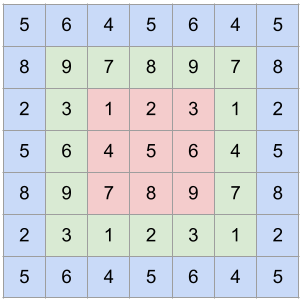

# Python-based TRT Plugins [Experimental]

This is a sample to showcase Python-based plugin definitions in TRT. No changes to existing TRT APIs have been made
to deliver this feature, so using the updated bindings should not break any existing code.

## Introduction

So far, plugin implementations could only be done through the TRT C++ API. To use a plugin in a Python app, one had to
 - Implement plugin in C++ and build into a shared library
 - Load plugin lib and register plugin creator (statically or dynamically)
 - Retrieve plugin creator and create plugin instance through the respective Python API

The following design considerations were followed in creating bindings to allow Python-based plugin definitions:
 - Zero additional C++ code shall be required to implement, integrate and run a plugin within TensorRT
 - Offer the flexibility to implement the kernel(s) for the plugin through any method of choice
   - Many libraries have sprung up to provide CUDA kernel support with AOT/JIT compilation
     - Numba, OpenAI Triton, CuPy etc.
   - Could even do without explicit kernels (e.g. leverage PyTorch functional op)

 - Will only support IPluginV2DynamicExt based plugins
   - Other plugin interfaces (except IPluginV2IOExt) are anyway deprecated since TRT 8.5

With these bindings, plugins can be implemented and integrated to TRT purely with Python.

## Setting Up The Build Environment

To build and install the bindings, follow the instructions in `$TRT_OSSPATH/python/README.md`.

Then install the requisite packages
```bash
cd $TRT_OSSPATH/samples/python/trt_python_plugin
pip3 install -r requirements.txt
```
Install `cupy-cuda12x` instead if testing on a CUDA 12.0 environment.

> NOTE: To run the Numba example on CUDA 12.0, either [build and install Numba from source](https://numba.readthedocs.io/en/stable/user/installing.html#installing-from-source) or install Numba through conda `conda install numba/label/dev::numba`.

> NOTE: This sample has been preliminarily tested on Windows/Ubuntu x86 with CUDA 11.8/12.0 (except for the Numba sample which has
only been tested with CUDA 11.8) 

# TensorRT Plugin API for Python

Implementing a TRT plugin in Python is similar to C++ in that an implementation of `IPluginV2DynamicExt` and `IPluginCreator` is necessary. Refer to the [full API doc](doc)
for a concise description.

The interface methods in Python have mostly similar APIs to their C++ counterparts, except for `serialize()` and `enqueue()`.
 - While the C++ API for `serialize()` is `void serialize (void *buffer)` where the plugin writes to the passed-in `buffer`, the Python API is `serialize(self) -> bytes`, where the implementation of the method is expected to return a bytes object containing a serialized representation of the plugin object. 
 - In `enqueue()`, the device pointers for input and output tensors are passed as their `intptr_t` casts. Since these buffers are created and owned by TRT, care must be taken when writing to them from the Python side.
  - No bindings yet for `attachToContext()` and `detachFromContext()` which are not pure virtual.

# Running the sample: Circular padding plugin

This sample contains a circular padding plugin, where the `enqueue` has been implemented with various frameworks for writing kernels or executing GPU ops (torch). 

Each script accepts a command-line argument to choose precision from either FP32 or FP16. e.g.
```bash
python3 circ_pad_plugin_cuda_python.py --precision fp32 # fp32 or fp16
```

## Circular padding

Circular padding is useful for ops like circular convolution in deep learning. The following image denotes how the original image (red) is circular padded once (green) and twice (blue):



The plugin shall have the following characteristics:
 - Input: 4-dimensional input (e.g. NxCxHxW)
 - Attribute(s): m-dimensional parameter `pads` where $m$ is even and $m/2 \le 4$. `pads` denotes the amount of padding to apply before and after each of the $m/2$ last dimensions of the input tensor.
 - Output: Padded tensor. Shape depends on `pads`.

## Baseline: Using a C++ plugin

To establish a baseline, we first demonstrate a C++ plugin implementing circular padding. The relevant files can be found in the `circ_plugin_cpp` folder: the included `CMakeLists.txt` can be used to build the shared library `licirc_pad_plugin.so` / `circ_pad_plugin.dll`.

```bash
cd $TRT_OSSPATH/samples/python/trt_python_plugin
mkdir build && pushd build
cmake .. && make -j
popd
python3 circ_pad_plugin_cpp.py --plugin-lib build/libcirc_pad_plugin.so
```

## Python plugin: cuda-python

The cuda-python based implementation can be found in `circ_pad_plugin_cuda_python.py`. `cuda.nvrtc` is used to JIT compile a C/C++-based kernel, which is provided as a string. The compiled kernel is then launched through cuda-python's `cuda.cuLaunchKernel`.

`circ_pad_plugin_cuda_python.py` demonstrates an ONNX-based workflow: `circ_pad_plugin_inetdef_cuda_python.py` demonstrates a workflow where the model is constructed through `INetworkDefinition`.

## Python plugin: CuPy

The CuPy-based implementation can be found in `circ_pad_plugin_cupy.py`. CuPy's `RawKernel` class has been used to provide the C/C++-based kernel implementation as a string. CuPy will JIT compile the kernel.

## Python plugin: Triton (valid only on Linux)

The same plugin can be implemented with a Triton-based kernel as well. The only other change would be to `enqueue`. The entire implementation can be found in `circ_pad_plugin_triton.py`.

Some remarks:
 - Triton also allows for JIT-able kernels.
 - CuPy device arrays cannot be passed into Triton kernels directly -- only Torch arrays are accepted. However, we can use `torch.as_tensor()` to get around this constraint.
 - Triton does not seem to allow the specification of a CUDA stream.

## Python plugin: Numba

The Numba implementation can be found in `circ_pad_plugin_numba.py`. Some remarks:
 - Numba also allows for JIT-able kernels.
 - CuPy device arrays can be passed into Numba kernels without issue since CuPy arrays implement `__cuda_array_interface__`.

## Python plugin: Torch

The flexibility of the `enqueue()` interface means that it is not always necessary to implement a custom kernel. In this case, PyTorch's [torch.nn.functional.pad](https://pytorch.org/docs/stable/generated/torch.nn.functional.pad.html) offers the exact same capability we want, so we can use that inside `enqueue()`, as in `circ_pad_plugin_torch.py`.

# Limitations

 - Plugins cannot be serialized into the engine (in contrast to `IBuilderConfig::setPluginsToSerialize()`)
   - Plugin class and Plugin Creator class must exist in the module where the engine is deserialized
 - The engine / ONNX model cannot be run from outside Python (e.g. with `trtexec`)
   - This functionality is possible to implement but comes at the cost of embedding the Python interpreter to the TRT runtime / the binary loading the engine
 - No bindings yet for `attachToContext()` and `detachFromContext()` which are not pure virtual.

# FAQ

1. What are the performance impacts of a Python-based plugin versus a C++ one?

   In preliminary testing, the Python overhead was found to be very minimal to negligible. In fact, if the kernels were compiled AOT (instead of JIT) the CuPY and Triton
   versions of the plugin were as performant as the C++ one. However, with Numba, there seems to be a significant kernel launch overhead.

2. Can I deploy a TRT engine including a Python plugin in a runtime environment without Python?

   No. There is no way to fully embed a Python plugin into the engine that allows for it to be executed without the need for Python during inference time.

   This design principle is what allows for the `enqueue()` to be implemented in any framework of choice.

# License

For terms and conditions for use, reproduction, and distribution, see the [TensorRT Software License Agreement](https://docs.nvidia.com/deeplearning/sdk/tensorrt-sla/index.html) documentation.

# Changelog

July 2023: Initial release of this sample

# Known issues

There are no known issues in this sample
