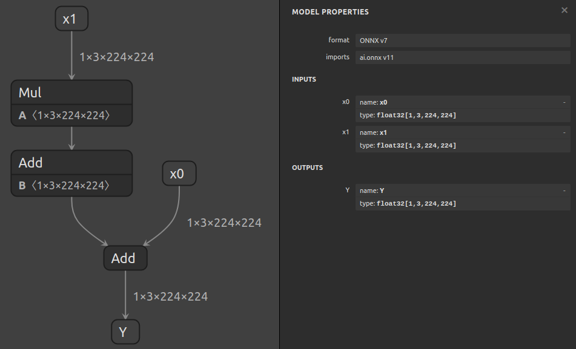

# Reducing Failing ONNX Models

## Introduction

When a model fails for any reason (for example, an accuracy issue in TensorRT) it is often
useful to reduce it to the smallest possible subgraph that triggers the failure. That makes
it easier to pinpoint the cause of the failure.

One approach to doing so is to generate successively smaller subgraphs of the original ONNX model.
At each iteration, we can check whether the subgraph works or is still failing; once we have a working
subgraph, we know that the subgraph generated by the previous iteration is the smallest failing
subgraph.

The `debug reduce` subtool allows us to automate this process.


## Running The Example

For the sake of this example, we'll assume our model (`./model.onnx`) has accuracy issues
in TensorRT. Since the model actually does work in TensorRT (please report a bug if not!),
we'll outline the commands that you would normally run followed by commands you can run to
simulate a failure to get a feel for how the tool looks in practice.

Our simulated failures will trigger whenever there's a `Mul` node in the model:



Hence, the final reduced model should contain just the `Mul` node (since the other nodes don't cause a failure).

1. For models that use dynamic input shapes or contain shape operations, freeze the input
    shapes and fold shape operations with:

    ```bash
    polygraphy surgeon sanitize model.onnx -o folded.onnx --fold-constants \
        --override-input-shapes x0:[1,3,224,224] x1:[1,3,224,224]
    ```

2. Let's assume ONNX-Runtime gives us correct outputs. We'll start by generating golden
    values for every tensor in the network. We'll also save the inputs we use:

    ```bash
    polygraphy run folded.onnx --onnxrt \
        --save-inputs inputs.json \
        --onnx-outputs mark all --save-outputs layerwise_golden.json
    ```

    Then we'll combine the inputs and layerwise outputs into a single layerwise inputs file
    using the `data to-input` subtool (we'll see why this is necessary in the next step):

    ```bash
    polygraphy data to-input inputs.json layerwise_golden.json -o layerwise_inputs.json
    ```


3. Next, we'll use `debug reduce` in `bisect` mode:

    ```bash
    polygraphy debug reduce folded.onnx -o initial_reduced.onnx --mode=bisect --load-inputs layerwise_inputs.json \
        --check polygraphy run polygraphy_debug.onnx --trt \
                --load-inputs layerwise_inputs.json --load-outputs layerwise_golden.json
    ```

    Let's break this down:

    - Like the other `debug` subtools, `debug reduce` generates an intermediate artifact each iteration
        (`./polygraphy_debug.onnx` by default). The artifact in this case is some subgraph of the original ONNX model.

    - In order for `debug reduce` to determine whether each subgraph fails or passes,
        we provide a `--check` command. Since we're looking into an accuracy issue,
        we can use `polygraphy run` to compare against our golden outputs from before.

        *TIP: Like other `debug` subtools, an interactive mode is also supported, which you can*
            *use simply by omitting the `--check` argument.*

    - In the `--check` command, we provide the layerwise inputs via `--load-inputs`, since otherwise, `polygraphy run`
        would generate new inputs for the subgraph tensors, which may not match the values those tensors
        had when we generated our golden data. An alternative approach is to run the reference implementation
        (ONNX-Runtime here) during each iteration of `debug reduce` rather than ahead of time.

    - Since we're using non-default input data, we also provide the layerwise inputs via `--load-inputs` directly to the
        `debug reduce` command (in addition to providing it to the `--check` command).
        This is important in models with multiple parallel branches (*referring to paths in the model rather than control flow*) like:
        <!-- Polygraphy Test: Ignore Start -->
        ```
         inp0  inp1
          |     |
         Abs   Abs
            \ /
            Sum
             |
            out
        ```
        In such cases, `debug reduce` needs to be able to replace one branch with a constant.
        To do so, it needs to know the input data you are using so that it can replace it with the correct values.
        Though we're using a file here, input data can be provided via any other Polygraphy data loader argument covered in
        [the CLI user guide](../../../../how-to/use_custom_input_data.md).

        In case you're not sure whether you need to provide a data loader,
        `debug reduce` will emit a warning like this when it tries to replace a branch:
        ```
        [W]     This model includes multiple branches/paths. In order to continue reducing, one branch needs to be folded away.
                Please ensure that you have provided a data loader argument to `debug reduce` if your `--check` command is using a non-default data loader.
                Not doing so may result in false negatives!
        ```
        <!-- Polygraphy Test: Ignore End -->

    - We specify the `-o` option so that the reduced model will be written to `initial_reduced.onnx`.

    **To Simulate A Failure:** We can use `polygraphy inspect model` in conjunction with `--fail-regex` to trigger
    a failure whenever the model contains a `Mul` node:

    ```bash
    polygraphy debug reduce folded.onnx -o initial_reduced.onnx --mode=bisect \
        --fail-regex "Op: Mul" \
        --check polygraphy inspect model polygraphy_debug.onnx --show layers
    ```

4. **[Optional]** As a sanity check, we can inspect our reduced model to ensure that it does contain the `Mul` node:

    ```bash
    polygraphy inspect model initial_reduced.onnx --show layers
    ```

5. Since we used `bisect` mode in the previous step, the model may not be as minimal as it could be.
    To further refine it, we'll run `debug reduce` again in `linear` mode:

    ```bash
    polygraphy debug reduce initial_reduced.onnx -o final_reduced.onnx --mode=linear --load-inputs layerwise_inputs.json \
        --check polygraphy run polygraphy_debug.onnx --trt \
                --load-inputs layerwise_inputs.json --load-outputs layerwise_golden.json
    ```

    **To Simulate A Failure:** We'll use the same technique as before:

    ```bash
    polygraphy debug reduce initial_reduced.onnx -o final_reduced.onnx --mode=linear \
        --fail-regex "Op: Mul" \
        --check polygraphy inspect model polygraphy_debug.onnx --show layers
    ```

6. **[Optional]** At this stage, `final_reduced.onnx` should contain just the failing node - the `Mul`.
    We can verify this with `inspect model`:

    ```bash
    polygraphy inspect model final_reduced.onnx --show layers
    ```


## Further Reading

- For more details on how the `debug` tools work, see the help output:
    `polygraphy debug -h` and `polygraphy debug reduce -h`.

- Also see the [`debug reduce` how-to guide](../../../../how-to/use_debug_reduce_effectively.md)
    for more information, tips, and tricks.
