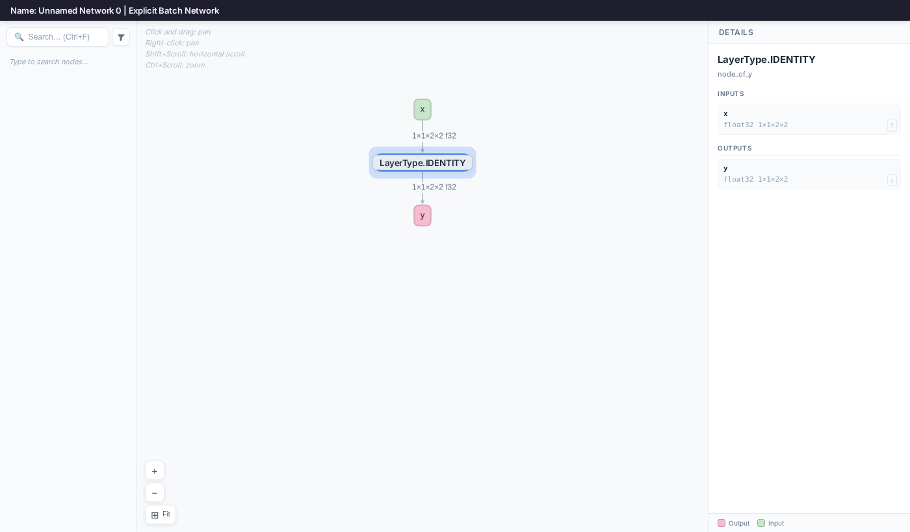

# Inspecting A TensorRT Network


## Introduction

The `inspect model` subtool can automatically convert supported formats
into TensorRT networks, and then display them.


## Running The Example

1. Display the TensorRT network after parsing an ONNX model:

    ```bash
    polygraphy inspect model identity.onnx \
        --show layers --display-as=trt
    ```

    This will display something like:

    ```
    [I] ==== TensorRT Network ====
        Name: Unnamed Network 0 | Explicit Batch Network

        ---- 1 Network Input(s) ----
        {x [dtype=float32, shape=(1, 1, 2, 2)]}

        ---- 1 Network Output(s) ----
        {y [dtype=float32, shape=(1, 1, 2, 2)]}

        ---- 1 Layer(s) ----
        Layer 0    | node_of_y [Op: LayerType.IDENTITY]
            {x [dtype=float32, shape=(1, 1, 2, 2)]}
             -> {y [dtype=float32, shape=(1, 1, 2, 2)]}
    ```

    It is also possible to show detailed layer information, including layer attributes, using `--show layers attrs weights`.

2. Alternatively, use `--visual` to launch an interactive graph viewer in your browser:

    <!-- Polygraphy Test: Ignore Start -->
    ```bash
    polygraphy inspect model identity.onnx \
        --display-as=trt --visual
    ```
    <!-- Polygraphy Test: Ignore End -->

    This opens the TensorRT network as an interactive DAG. Click any node to inspect
    its inputs, outputs, and attributes in the details panel on the right:

    

    *TIP: Use `--visual-port` to specify a custom port, e.g. when running inside a*
    *container: `polygraphy inspect model identity.onnx --display-as=trt --visual --visual-port 8080`*
