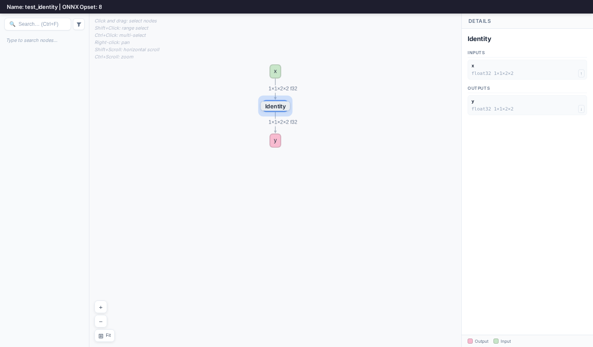

# Inspecting An ONNX Model


## Introduction

The `inspect model` subtool can display ONNX models.


## Running The Example

1. Inspect the ONNX model:

    ```bash
    polygraphy inspect model identity.onnx --show layers
    ```

    This will display something like:

    ```
    [I] ==== ONNX Model ====
        Name: test_identity | ONNX Opset: 8

        ---- 1 Graph Input(s) ----
        {x [dtype=float32, shape=(1, 1, 2, 2)]}

        ---- 1 Graph Output(s) ----
        {y [dtype=float32, shape=(1, 1, 2, 2)]}

        ---- 0 Initializer(s) ----
        {}

        ---- 1 Node(s) ----
        Node 0    |  [Op: Identity]
            {x [dtype=float32, shape=(1, 1, 2, 2)]}
             -> {y [dtype=float32, shape=(1, 1, 2, 2)]}
    ```

    It is also possible to show detailed layer information, including layer attributes, using `--show layers attrs weights`.

2. Alternatively, use `--visual` to launch an interactive graph viewer in your browser:

    <!-- Polygraphy Test: Ignore Start -->
    ```bash
    polygraphy inspect model identity.onnx --visual
    ```
    <!-- Polygraphy Test: Ignore End -->

    This starts a local HTTP server (default port 8000) and opens the model as an
    interactive DAG in your browser. Click any node to inspect its inputs, outputs,
    and attributes in the details panel on the right. For ONNX models, extract mode
    is always active: click and drag to select nodes, then use the **Extract Subgraph**
    panel to generate a `polygraphy surgeon extract` command or save the subgraph directly.

    

    *TIP: Use `--visual-port` to specify a custom port, e.g. when running inside a*
    *container: `polygraphy inspect model identity.onnx --visual --visual-port 8080`*
