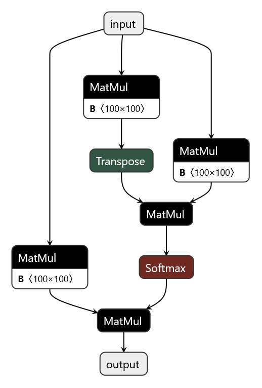

# Using Shard To Convert a SD Model to MD


## Introduction

The `shard` tool can be used to convert single-device (SD) models containing attention layers into multi-device (MD) models intended to be run on multiple GPUs using a hints file.

In this example, we'll show how to shard a simple model containing an attention layer



## Hint Configuration

For this example we'll be using [this hints file](./hint.json).

See the [Shard README](../../../../polygraphy/tools/multi_device/README.md#sharding-hints-file-format) for an explanation of the hints file format.


## Running the Example

```bash
polygraphy multi-device shard \
    ../attention.onnx \
    -s hint.json \
    -o attention_md.onnx
```

Looking at the result, we can now see the model is ready to be run on multiple GPUs through TensorRT


### A Note On Gathering Q

If we changed `gather_q` in the hints to `true` the model effectively becomes SD, and a final all-gather will not be inserted. All attention layers must have Q consistently sharded, as it affects whether or not to place an all-gather at the output of the model

