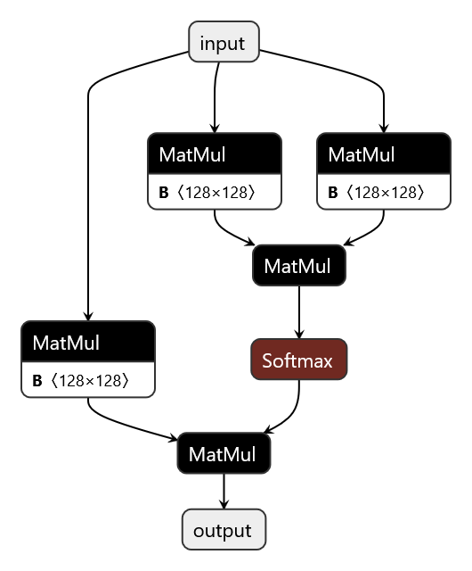
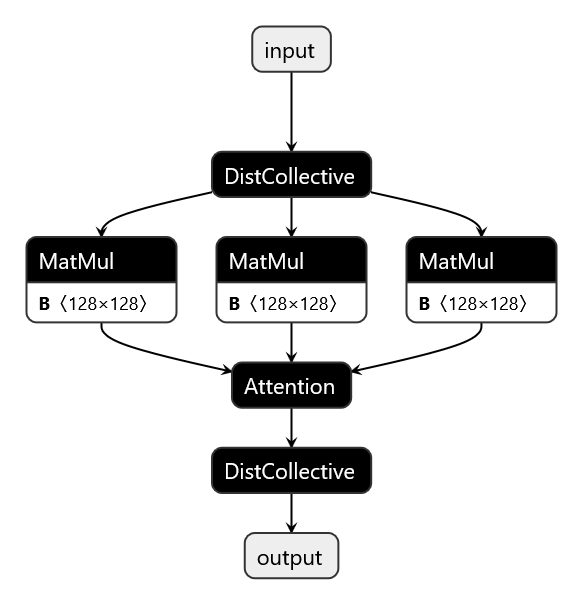

# Using Shard to Convert a SD model to MD with Fused Attention Replacement

## Introduction

The `shard` tool can enable TensorRT to recognize when attention ops should be ran in MD (multi-device) mode.

In this example, we'll show how to shard a simple model and replace the attention layer with fused attention.



## Hint Configuration

For this example we'll be using [this hints file](./hint.json). 

See the [Shard README](../../../../polygraphy/tools/multi_device/README.md#sharding-hints-file-format) for an explanation of the hints file format.

### Hints generation

This hints file was generated by running

```bash
polygraphy template shard-hints \
    ../attention.onnx \
    --cp-type fused \
    -o hint.json
```

## Running the Example

```bash
polygraphy multi-device shard \
    ../attention.onnx \
    -s hint.json \
    -o attention_md.onnx
```

Looking at the result, we can now see the model is sharded, and the attention has been fused into one attention operation with an attribute indicating to TensorRT this attention should be executed in MD mode.



