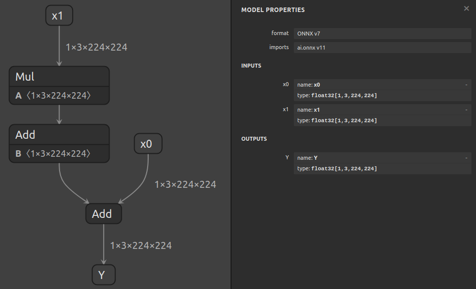
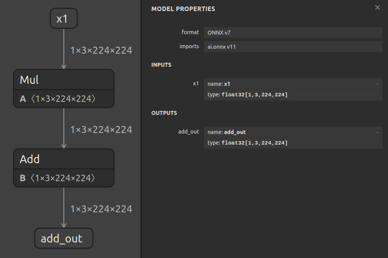

# Using Extract To Isolate A Subgraph


## Introduction

The `surgeon extract` subtool can be used to extract a subgraph from a model with a single command.

In this example, we'll extract a subgraph from a model that computes `Y = x0 + (a * x1 + b)`:



Let's assume that we want to isolate the subgraph that computes `(a * x1 + b)`, and that we've
used `polygraphy inspect model model.onnx --show layers` to determine the names of the input/output tensors
of this subgraph, but that we don't know the shapes or data types of any of the tensors involved.

When shapes and data types are unknown, you can use `auto` to indicate that Polygraphy should
attempt to automatically determine these.
For inputs, we must specify both shape and data type, whereas outputs only require the data
type - hence `--inputs` requires 2 `auto`s and `--outputs` requires only 1.


## Running The Example

1. Extract the subgraph:

    ```bash
    polygraphy surgeon extract model.onnx \
        --inputs x1:auto:auto \
        --outputs add_out:auto \
        -o subgraph.onnx
    ```

    If we knew the shapes and/or data types, we could instead write, for example:

    ```bash
    polygraphy surgeon extract model.onnx \
        --inputs x1:[1,3,224,224]:float32 \
        --outputs add_out:float32 \
        -o subgraph.onnx
    ```

    The resulting subgraph will look like this:

    

2. **[Optional]** At this point, the model is ready for use. You can use `inspect model`
    to confirm whether it looks correct:

    ```bash
    polygraphy inspect model subgraph.onnx --show layers
    ```

## A Note On `auto`

When `auto` is specified as a shape or data type, Polygraphy relies on ONNX shape
inference to determine the shapes and data types of intermediate tensors.

In cases where ONNX shape inference cannot determine shapes, Polygraphy
will run inference on the model using ONNX-Runtime with synthetic input data
You can control the shape of this input data using the `--model-inputs` argument
and the contents using the `Data Loader` options.

This will cause the inputs of the resulting subgraph to have fixed shapes. You can change
these back to dynamic by using the extract command again on the subgraph, and specifying
the same inputs, but using shapes with dynamic dimensions, e.g. `--inputs identity_out_0:[-1,-1]:auto`
