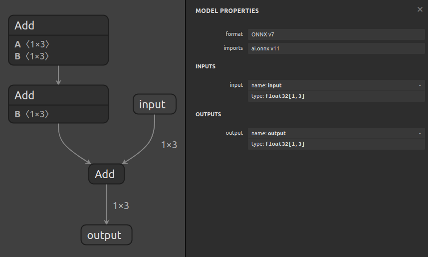
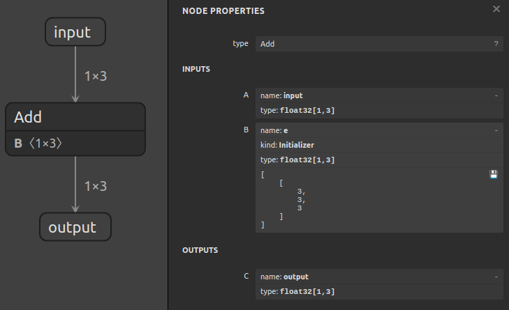

# Using Sanitize To Fold Constants


## Introduction

The `surgeon sanitize` subtool can be used to fold constants in graphs,
remove unused nodes, and topologically sort nodes. In cases where shapes
are statically known, it can also simplify subgraphs involving shape operations.

In this example, we'll fold constants in a graph that computes `output = input + ((a + b) + d)`,
where `a`, `b`, and `d` are constants:




## Running The Example

1. Fold constants with:

    ```bash
    polygraphy surgeon sanitize model.onnx \
        --fold-constants \
        -o folded.onnx
    ```

    This collapses `a`, `b`, and `d` into a constant tensor, and the resulting graph
    computes `output = input + e`:

    

    *TIP: Sometimes, models include operations like `Tile` or `ConstantOfShape`, that may*
        *generate large constant tensors. Folding these can bloat the model size*
        *to an undesirable degree. You can use the `--fold-size-threshold` to control*
        *the maximum size, in bytes, for which to fold tensors. Any nodes that generate*
        *tensors over this limit will not be folded, but instead computed at runtime.*

2. **[Optional]** You can use `inspect model` to confirm whether it looks correct:

    ```bash
    polygraphy inspect model folded.onnx --show layers
    ```
