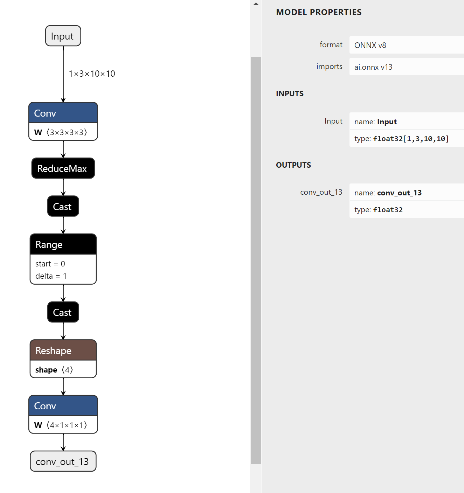
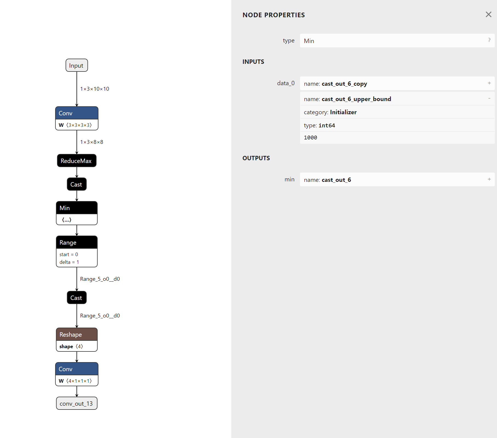

# Using Sanitize To Set Upper Bounds For Unbounded Data-Dependent Shapes (DDS)


## Introduction

The `surgeon sanitize` subtool can be used to set upper bounds for unbounded Data-Dependent Shapes (DDS).
When the shape of a tensor depends on the runtime value of another tensor, such shape is called DDS.
Some DDS has a limited upper bound. For example, the output shape of a `NonZero` operator is a DDS, but its output shape will not exceed the shape of its input.
While, some other DDS has no upper bound. For example, the output of a `Range` operator has an unbounded DDS when the `limit` input is a runtime tensor.
Tensors with unbounded DDS are difficult for TensorRT to optimize inference performance and memory usage at builder stage. 
In the worst case, they can cause TensorRT engine building failures. 

In this example, we'll use polygraphy to set upper bounds for an unbounded DDS in a graph:




## Running The Example

1. Run constant folding for the model first:

    ```bash
    polygraphy surgeon sanitize model.onnx -o folded.onnx --fold-constants
    ```

    Note that const folding and symbolic shape inference are required for listing unbounded DDS and setting upper bounds.

2. Find tensors with unbounded DDS with:

    ```bash
    polygraphy inspect model folded.onnx --list-unbounded-dds
    ```

    Polygraphy will show all tensors with unbounded DDS.

3. Set upper bounds for unbounded DDS with:

    ```bash
    polygraphy surgeon sanitize folded.onnx --set-unbounded-dds-upper-bound 1000 -o modified.onnx 
    ```

    Polygraphy will first search all tensors with unbounded DDS. 
    Then it will insert min operators with the provided upper bound values to limit the DDS tensor size.
    In this example, a min operator is inserted before the `Range` operator.
    With the modified model, TensorRT will know that the output shape of the `Range` operator will not exceed 1000.
    Thus more kernels can be selected for the following layers.

    

4. Check that there is no tensors with unbounded DDS now:

    ```bash
    polygraphy inspect model modified.onnx --list-unbounded-dds
    ```

    The modified.onnx should contain no unbounded DDS now.