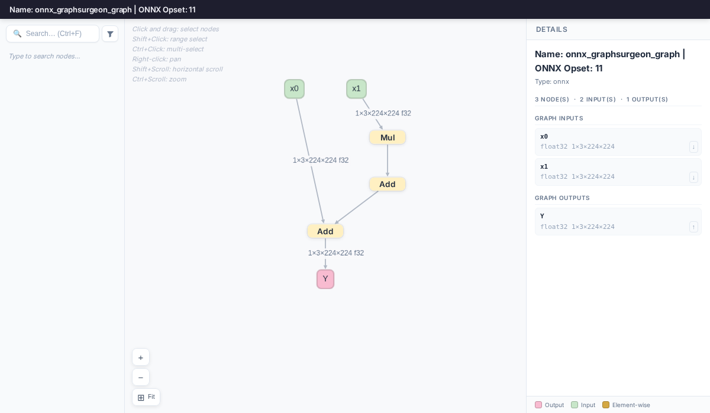
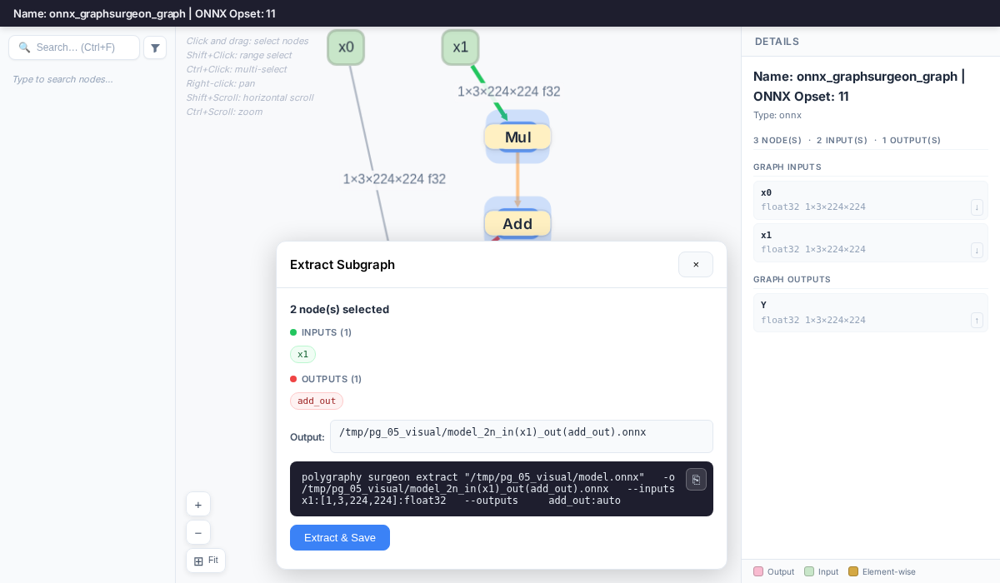
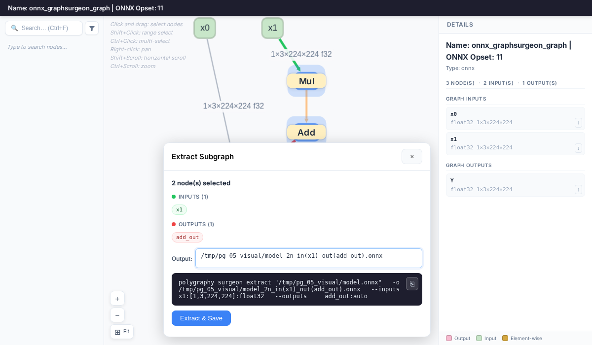
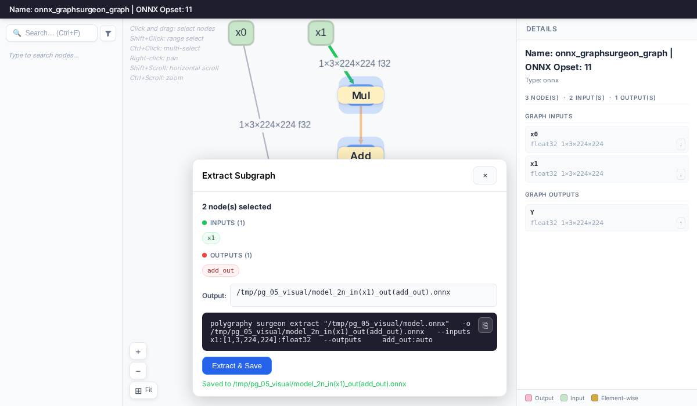

# Extracting A Subgraph With The Visual Tool


## Introduction

The `inspect model --visual` viewer can be used to extract subgraphs interactively,
without needing to look up tensor names and types manually.

In this example, we'll extract the same subgraph as in
[01_isolating_subgraphs](../01_isolating_subgraphs/README.md) — the part of
`Y = x0 + (a * x1 + b)` that computes `(a * x1 + b)` — but using the visual tool
instead of specifying `--inputs` and `--outputs` by hand.


## Running The Example

1. Launch the interactive viewer:

    ```bash
    polygraphy inspect model model.onnx --visual
    ```

    This opens the model as an interactive DAG in your browser. Extract mode is
    always active for ONNX models — click and drag to start selecting nodes
    immediately:

    

2. Click and drag a selection box over the nodes you want to extract
   (the `Mul` and `Add` nodes that compute `a * x1 + b`).
   Selected nodes are highlighted in blue; edges between selected nodes are
   highlighted in orange. The **Extract Subgraph** panel shows the detected
   boundary tensors — inputs in green, outputs in red — and the equivalent
   `polygraphy surgeon extract` command:

    *TIP: Use Shift+Click to range-select all nodes on a path between two nodes,*
    *or Ctrl+Click to add individual nodes to the selection.*

    

3. **[Optional]** Edit the output path in the text field at the bottom of the panel.

    

4. Click **Extract & Save**. The subgraph is extracted and saved to the specified path:

    

    *TIP: The panel also shows the equivalent CLI command if you prefer to run*
    *extraction outside the viewer.*
