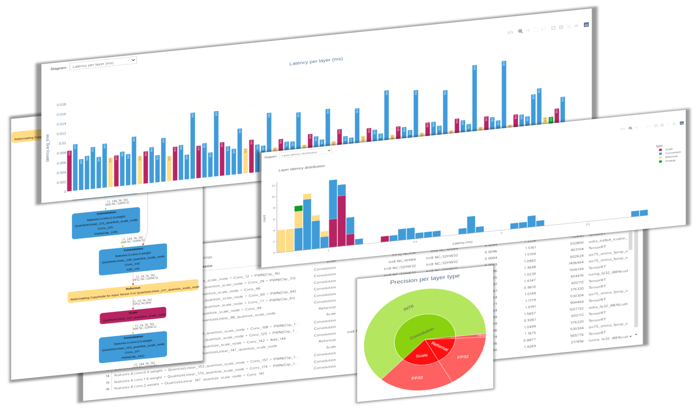
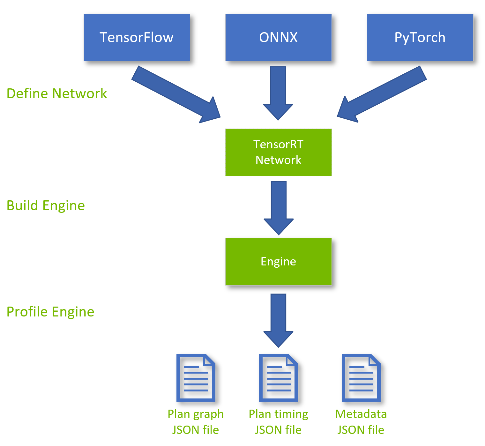

# trt-engine-explorer



This repository contains Python code (`trex` package) to explore various aspects of a TensorRT engine plan and its associated inference profiling data.

An engine plan file is a serialized TensorRT engine format. It contains information about the final inference graph and can be deserialized for inference runtime execution.  An engine plan is specific to the hardware and software versions of the system used to build the engine.

`trex` is useful for initial model performance debugging, visualization of plan graphs, and for understanding the characteristics of an engine plan. <b>For in-depth performance analysis, [Nvidia &reg; Nsight Systems &trade;](https://developer.nvidia.com/nsight-systems) is the recommended performance analysis tool.</b>

# Features
The `trex` package contains an API and Jupyter notebooks for viewing and inspecting TensorRT engine-plan files and profiling data.

* An engine plan graph (JSON) is loaded to a Pandas dataframe which allows slicing, querying, filtering, viewing and diagraming.
* An engine plan graph can be visualized as SVG/PNG files.
* Layer linters are an API for flagging potential performance hazards (preview feature).
* Four Jupyter notebooks provide:
  * An introduction to `trex` tutorial.
  * `trex` API examples.
  * Detailed engine plan performance, characteristics and structure analysis.
  * Comparison of two or more engine plans.
* Because `trex` operates on JSON input files, it does not require a GPU.

## Caveats
When `trtexec` times individual layers, the total engine latency (computed by summing the average latency of each layer) is higher than the latency reported for the entire engine. This is due to per-layer measurement overheads.

To measure per-layer execution times, when `trtexec` enqueues kernel layers for execution in a stream, it places CUDA event objects between the layers to monitor the start and completion of each layer. These CUDA events add a small overhead which is more noticeable with smaller networks (shallow and narrow networks or networks with small activation data).

## Supported TensorRT Versions
Starting with TensorRT 8.2, engine-plan graph and profiling data can be exported to JSON files. `trex` supports TensortRT 8.x, 9.x and 10.0.

`trex` has only been tested on 22.04 with Python 3.10.12.<br>
`trex` does not require a GPU, but generating the input JSON file(s) does require a GPU.

<details><summary><h1>Installation</h1></summary>


The instructions below detail how to use a Python3 virtualenv for installing and using trex (Python 3.8+ is required).

### 1. Clone the trex code repository from TensorRT OSS repository
```
$ git clone https://github.com/NVIDIA/TensorRT.git
```

### 2. Create and activate a Python virtual environment
The commands listed below create and activate a Python virtual environment named ```env_trex``` which is stored in a directory by the same name, and configures the current shell to use it as the default python environment.

```
$ cd TensorRT/tools/experimental/trt-engine-explorer
$ python3 -m virtualenv env_trex
$ source env_trex/bin/activate
```

### 3. Install trex in development mode
To install core functionality only:
```
$ python3 -m pip install -e .
```

To install all packages (core + packages required for using Jupyter notebooks):

```
$ python3 -m pip install -e .[notebook]
```

### 4. Install Graphviz
Generating dot and SVG graphs requires Graphviz, an open source graph visualization software:
```
$ sudo apt --yes install graphviz
```
</details>

<details><summary><h1>Workflow</h1></summary>

The typical `trex` workflow is depicted below:
1. <b>Convert</b> an external model to a TensorRT `INetworkDefinition`.
2. <b>Build</b> a TensorRT engine.
3. <b>Profile</b> the engine while creating the necessary JSON files.
4. <b>Explore</b> the engine by loading the JSON files in a `trex` notebook.
<br>



The Python script `utils/process_engine.py` implements this workflow for ONNX models:
1. Use `trtexec` to import an ONNX model and create an engine.
2. Load the engine and create an engine-graph JSON file.
3. Use `trtexec` to profile the engine's inference execution and store the results in an engine profiling JSON file.
4. Create an engine graph diagram in SVG format.
<br>

For more information see [TensorRT Engine Inspector](https://docs.nvidia.com/deeplearning/tensorrt/developer-guide/index.html#engine-inspector) and the [Tutorial](notebooks/tutorial.ipynb) notebook.
</details>

<details><summary><h1>Jupyter Server</h1></summary>

Launch the Jupyter notebook server as detailed below and open your browser at `http://localhost:8888` or `http://<your-ip-address>:8888`
```
$ jupyter-notebook --ip=0.0.0.0 --no-browser
```

If you're using JupyterLab, you can launch the server with:
```
$ jupyter lab --ip=0.0.0.0 --port=8888
```
</details>

<details><summary><h1>License</h1></summary>

The TensorRT Engine Explorer license can be found in the [LICENSE](LICENSE.txt) file.

</details>
