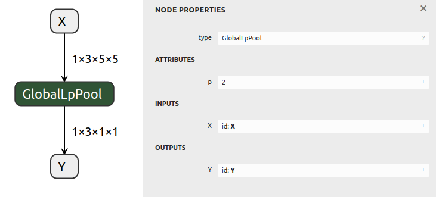

# Creating An ONNX Model

## Introduction

ONNX GraphSurgeon includes an [IR (intermediate representation)](../../README.md#ir)
that can be exported to ONNX. Additionally, the IR exposes a simple API so that it is
possible to build graphs manually.

This example creates an ONNX model containing a single GlobalLpPool node.

## Running the example

Generate the model and save it to `test_globallppool.onnx` by running:

```bash
python3 example.py
```

The generated model will look like this:


