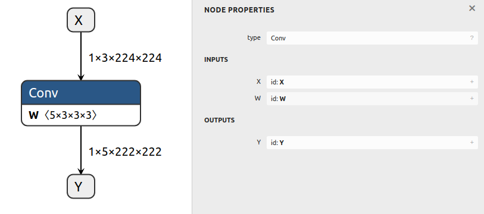

# Creating An ONNX Model With An Initializer

## Introduction

This example creates an ONNX model containing a single Convolution node with weights.

`Constant`s in ONNX GraphSurgeon are automatically exported as initializers in the ONNX graph.

## Running the example

Generate the model and save it to `test_conv.onnx` by running:
```bash
python3 example.py
```

The generated model will look like this:


