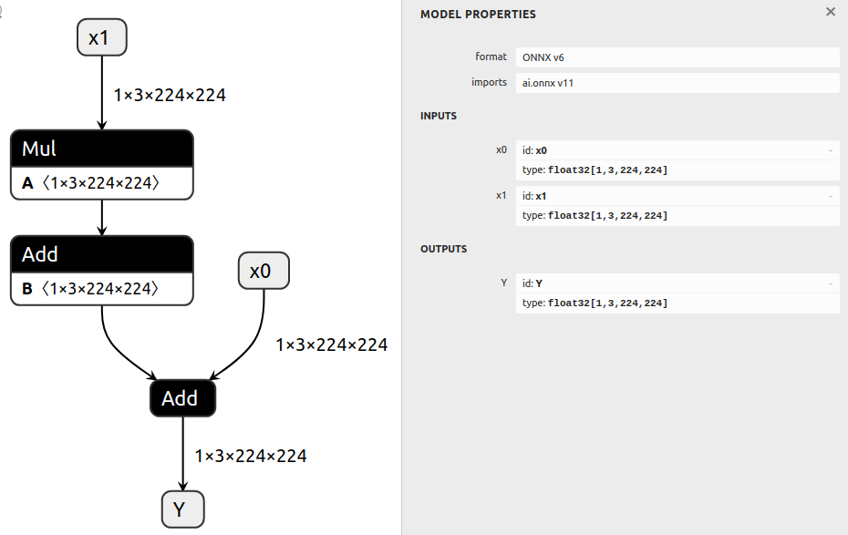
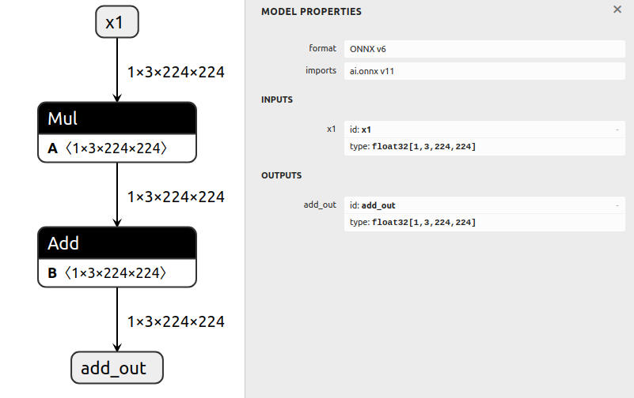

# Isolating A Subgraph

## Introduction

This example first generates a basic model,
then extracts a subgraph from this model.

Isolating a subgraph from a model is as simple as modifying the inputs and
outputs of the graph, running `graph.cleanup()`, and then re-exporting the graph.

We do **not** need to know which nodes, initializers, or intermediate tensors we
want - marking the inputs and outputs is sufficient for ONNX GraphSurgeon to be able
to determine the other information automatically.

## Running the example

1. Generate a model with several nodes and save it to `model.onnx` by running:
    ```bash
    python3 generate.py
    ```

    The generated model computes `Y = x0 + (a * x1 + b)`:

    

2. Isolate the subgraph that computes `(a * x1 + b)` and save it to `subgraph.onnx` by running:
    ```bash
    python3 isolate.py
    ```

    The resulting model computes `add_out = (a * x1 + b)`:

    
