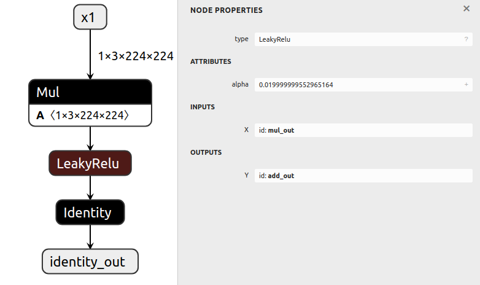

# Modiyfing A Model

## Introduction

This example first generates a basic model,
then modifies the resulting model in various ways.

By importing an ONNX graph into the [ONNX GraphSurgeon IR](../../README.md#ir), it is
possible to modify virtually every aspect of the graph.
We can then export the modified IR back to ONNX.

## Running the example

1. Generate a model with several nodes and save it to `model.onnx` by running:
    ```bash
    python3 generate.py
    ```

    The generated model computes `Y = x0 + (a * x1 + b)`:

    

2. Modify the model in various ways, and save it to `modified.onnx` by running:
    ```bash
    python3 modify.py
    ```

    This script does the following:
    - Removes the `b` input of the first `Add` node
    - Changes the first `Add` to a `LeakyRelu`
    - Adds an `Identity` node after the first `Add`
    - Changes the output of the graph to be the output of the `Identity` node
    - Runs `cleanup()` which removes the `x0` tensor and second `Add` node due to the previous change to the graph outputs.

    The resulting graph computes `identity_out = leaky_relu(a * x1)`:

    
