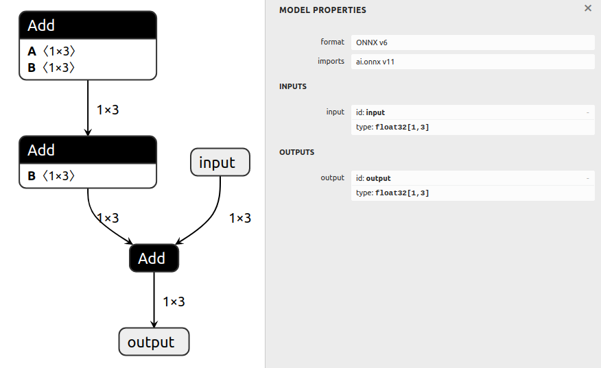
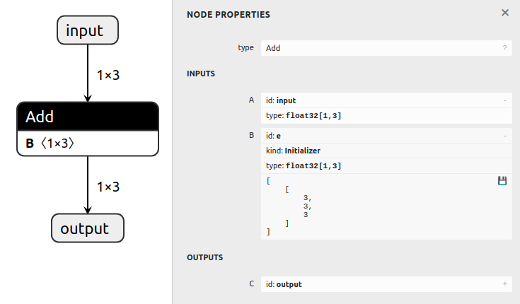

# Folding Constants

## Introduction

This example first generates a a model with several operations that can be evaluated
prior to inference time, then folds these operations and exports a new model.

Constant folding involves pre-computing expressions that do not depend on runtime
information. Practically, this would mean that any nodes that are dependent only on
`Constant`s in an ONNX GraphSurgeon graph can be folded.

One limitation of ONNX GraphSurgeon's built-in constant folding is that it will not
rotate nodes. So, assuming `x` is a graph input and `c0`, `c1` and `c2` are constants in
the graph:
- `x + (c0 + (c1 + c2))` **will** be folded
- `((x + c0) + c1) + c2` will **not** be folded, even though this is mathematically equivalent
        (when not considering floating point rounding error) to the previous expression.

## Prerequisites

1. ONNX GraphSurgeon uses [ONNX Runtime](https://github.com/microsoft/onnxruntime) to
    evaluate the constant expressions in the graph. This can be installed with:
    ```bash
    python3 -m pip install onnxruntime
    ```

## Running the example

1. Generate a model with several nodes and save it to `model.onnx` by running:
    ```bash
    python3 generate.py
    ```

    The generated model computes `output = input + ((a + b) + d)` where `a`,`b`, and `d` are constants
    all set to `1`:

    

2. Fold constants in the graph, and save it to `folded.onnx` by running:
    ```bash
    python3 fold.py
    ```

    This will replace the expression: `((a + b) + d)` with a single constant tensor (which will be all `3`s).
    The resulting graph will compute `output = input + e` where `e = ((a + b) + d)`:

    This script will also display the help output for `Graph.fold_constants()`

    
