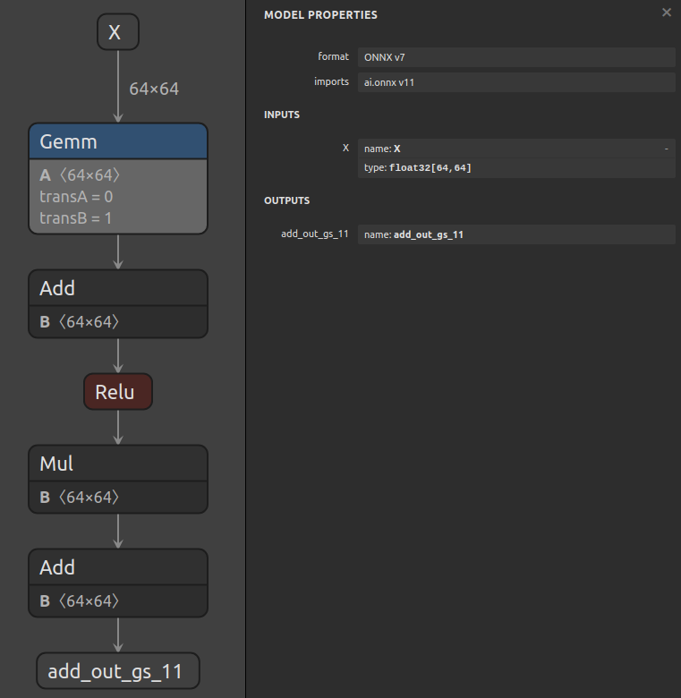

# Creating A Model Using The Graph Layer API

## Introduction

This example uses the `Graph.layer()` function in conjunction with `Graph.register()` to
demonstrate how to construct complicated ONNX models more easily.

The `Graph.layer()` API allows you to more easily add `Node`s to a `Graph`. In addition to
creating nodes, this function can also create the input and output tensors, and automatically
insert the node in the graph. For details, see the `help` output for `Graph.layer()`.

**Note**: You still need to set `Graph` inputs and outputs yourself!

`Graph.layer()` can be used to implement your own functions that can be registered with `Graph.register()`.
For example, to implement a `graph.add` function that inserts an "Add" operation into the graph, you could write:
```python
@gs.Graph.register()
def add(self, a, b):
    return self.layer(op="Add", inputs=[a, b], outputs=["add_out"])
```

and invoke it like so:
```python
[Y] = graph.add(*graph.add(X, B), C)
```

This would add a set of nodes which compute `Y = (X + B) + C` (assuming X, B, C are some tensors in the graph)
to the graph without requiring you to manually create the intermediate tensors involved.

## Running the example

1. Generate a moderately complex model and save it to `model.onnx` by running:
    ```bash
    python3 generate.py
    ```

    This script will also display the help output for `Graph.layer()`

    The generated model will look like this:

    
