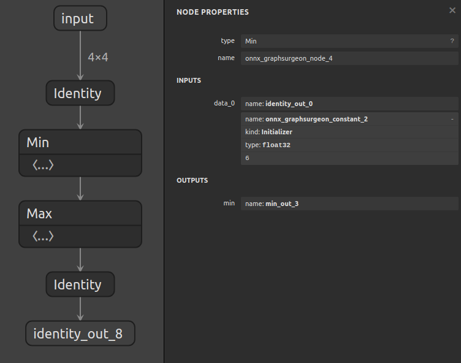
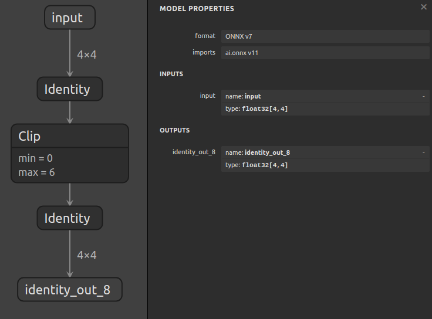

# Replacing A Subgraph

## Introduction

This example first generates a model consisting of a `Min` op followed by a
`Max`, and then uses the `graph.layer()` and `graph.register()` APIs seen in
[example 07](../07_creating_a_model_with_the_layer_api) to create a function
that can be used to replace this subgraph with a `Clip` op.

This can be useful, for example, to enable TensorRT plugins with ONNX.


## Subgraph Replacement Basics

The process of replacing a subgraph involves 3 steps. For example, for a graph
with the following structure:

         Tensor0
            |
          Node0
            |
         Tensor1    Tensor2
               \    /
                Node1
                  |
               Tensor3
                  |
                Node2

In order to replace the subgraph consisting of [`Node0`, `Node1`], we need to:

1. Disconnect the **outputs** of the subgraph inputs: `Tensor0` and `Tensor2`

    That means we need to delete the edge between `Tensor0` and `Node0`,
    and between `Tensor2` and `Node1`.

2. Disconnect the **inputs** of the subgraph outputs: `Tensor3`

    That means we need to delete the edge between `Node1` and `Tensor3`.

This will leave us with a graph like this:

         Tensor0     Tensor2

               Tensor3
                  |
                Node2

And the now disconnected subgraph:

          Node0
            |
         Tensor1
               \
                Node1

3. Lastly, we need to insert our node such that it has inputs: [`Tensor0`, `Tensor2`]
    and outputs: [`Tensor3`, ].

After this step, we have our final graph (`cleanup()` will remove the dangling subgraph):

         Tensor0     Tensor2
               \     /
              MyNewNode0
                  |
               Tensor3
                  |
                Node2

## Running the example

1. Generate a the model including `Min` and `Max` ops by running:
    ```bash
    python3 generate.py
    ```

    The generated model will compute `max(min(x, 6), 0)` and look like this:

    

2. Replace the subgraph with a `Clip` op by running:
    ```bash
    python3 replace.py
    ```

    The final model will include a `clip(x, min=0, max=6)` and look like this:

    
