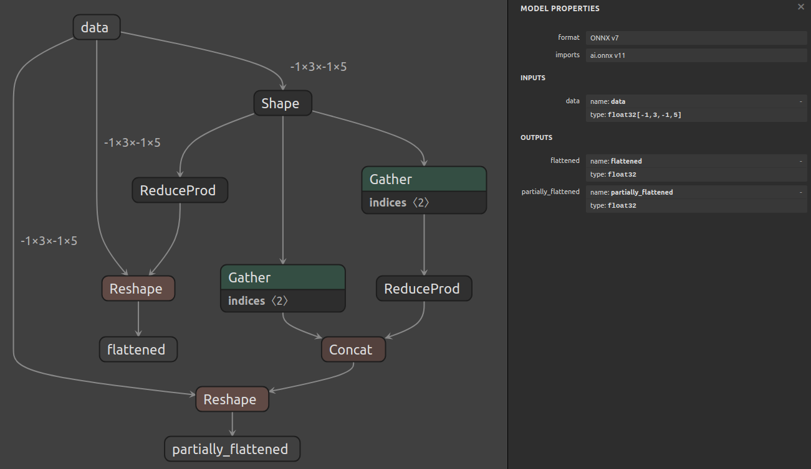

# Shape Operations With The Layer API

## Introduction

This example uses the layer API outlined in [example 07](../07_creating_a_model_with_the_layer_api/)
to create a model that implements shape operations on inputs with dynamic shapes.

Specifically, two common cases are outlined:

1. Flattening an input tensor that includes dynamic dimensions. The layers involved are:
    - `Shape`: to get the input shape.
    - `ReduceProd`: to compute the volume of the input shape.
    - `Reshape`: to change the shape of the input to its volume.

2. Collapsing some, but not all, dimensions of an input tensor that includes dynamic dimensions. The layers involved are:
    - `Shape`: to get the input shape.
    - `Gather`: to get the first 2 dimensions of the input shape.
    - `Gather`: to get the last 2 dimensions of the input shape.
    - `ReduceProd`: to compute the volume of the last 2 dimensions.
    - `Concat`: to combine the first dimension of the original shape with the volume of the other dimensions.
    - `Reshape`: to reshape the input based on the computed shape.

## Running the example

1. Generate the model and save it to `model.onnx` by running:
    ```bash
    python3 generate.py
    ```

    The generated model will look like this:

    
