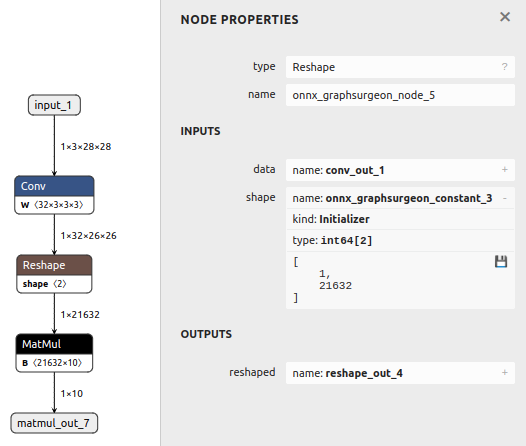
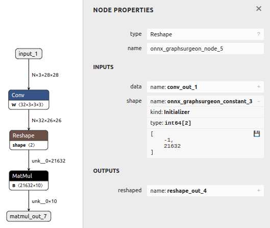

# Dynamic Batch Size

## Introduction

This example first generates a basic model with static batch size in the input,
then modifies the resulting model with dynamic batch size.

## Basics: modifying the input's batch size
Below is the main code necessary to convert a static ONNX model to dynamic:
```python
graph = gs.import_onnx(onnx_model)
for input in graph.inputs:
   input.shape[0] = 'N'
```

The above code should be enough for simple models.
However, some models might also need their internal layers updated, such as static `Reshape` layers.
Please see the section below for an example of this scenario. 

## Running the example

1. Generate a model with static input shape and several nodes (including static `Reshape`), and save it to `model.onnx` by running:
    ```bash
    python3 generate.py
    ```

    

2. Convert the model to support dynamic batch size, and save it to `modified.onnx` by running:
    ```bash
    python3 modify.py
    ```

    This script does the following:
    - Updates the inputs' batch size to `N` (dynamic symbol)
    - Updates the shape of `Reshape` nodes (if they exist) to `-1` (dynamic value)
    
    The resulting graph now supports any batch size:

    
