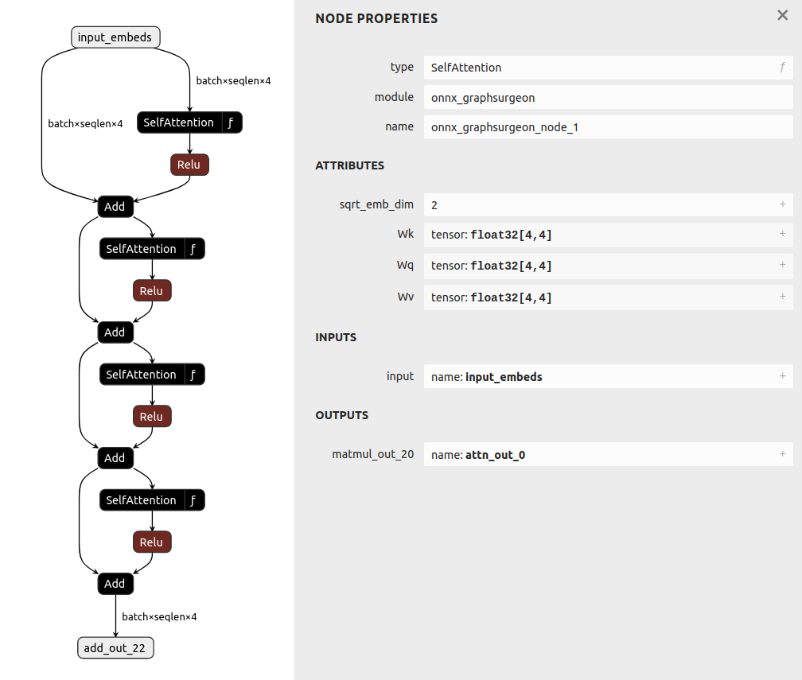
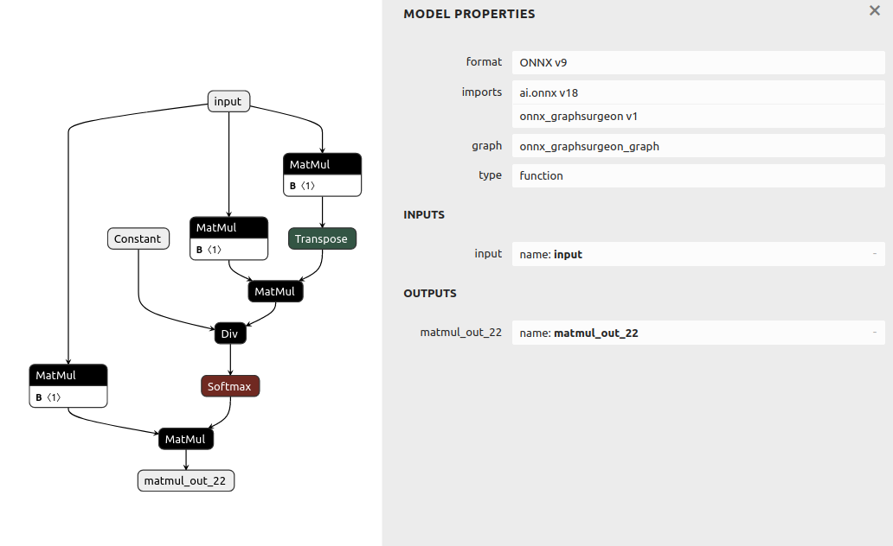

# Local Functions

## Introduction

This example generates a model which uses ONNX Functions.
Functions are a way to specify a default implementation for a Custom Op.

## Basics

A Function can be created and modified the same way as a Graph.

```python
custom_func = gs.Function("CustomOp", inputs=[gs.Variable("input")], outputs=[gs.Variable("output")])
custom_func_relu_node = gs.Node(op="Relu", inputs=custom_func.inputs.copy(), outputs=custom_func.outputs.copy())
custom_func.nodes.append(custom_func_relu_node)
```

To use a Function in a graph, add the Function to the graph's list of functions.
Then, that Function will serve as a default implementation for nodes in the graph with the same
op and domain as the Function.

```python
graph = gs.Graph(inputs=[gs.Variable("model_input")], functions=[custom_func])
graph.outputs = graph.CustomOp(inputs=[graph.inputs[0]])
```

The node could also have been created manually using the `Node()` constructor:

```python
node = gs.Node(op=custom_func.name, domain=custom_func.domain)
node.inputs = [graph.inputs[0]]
node.outputs = [gs.Variable("custom_op_output")]
graph.nodes.append(node)
```

## Function Attributes

Nodes inside of functions can have attributes which refer to values passed in when the Function is instantiated.
The function holds a list of such attributes which can be overridden.

```python
func_input = gs.Variable("input")
func_output = gs.Variable("output")
func = gs.Function("Concat_Softmax", inputs=[func_input], outputs=[func_output])
concat_node = gs.Node(op="Concat", inputs=[func_input], outputs=[gs.Variable("concat_out")])
softmax_node = gs.Node(op="Softmax", inputs=[concat_node.outputs[0]], outputs=[func_output])
func.nodes = [concat_node, softmax_node]

# Specify the attributes that can be supplied to the function, and their default values.
func.attrs = {
    "concat_axis": None, # 'None' means no default value
    "softmax_axis": -1,
}

# Setup the node attributes to refer to the Function's attributes.
# We also need to specify the type of the attribute.
concat_node.attrs = {"axis": gs.Node.AttributeRef("concat_axis", int)}
softmax_node.attrs = {"axis": gs.Node.AttributeRef("softmax_axis", int)}

# Now we can specify the attribute values when we instantiate the Function.
graph.functions.append(func)
node_1_outputs = graph.Concat_Softmax(inputs=["input1"], attrs={"concat_axis": 1})
node_2_outputs = graph.Concat_Softmax(inputs=["input2"], attrs={"concat_axis": 0, "softmax_axis": 0})
```


## Running the example

1. Generate the model:
    ```bash
    python3 generate.py
    ```

    This creates a model with Custom SelfAttention ops.

    

    The SelfAttention op is build out of ONNX primitives:

    
