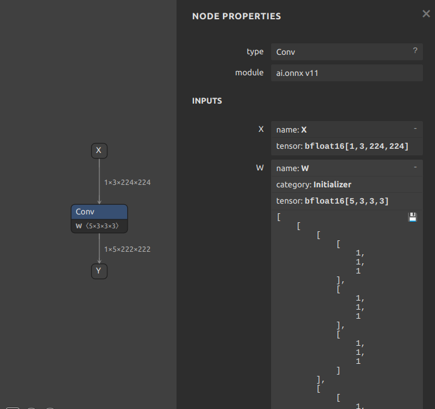
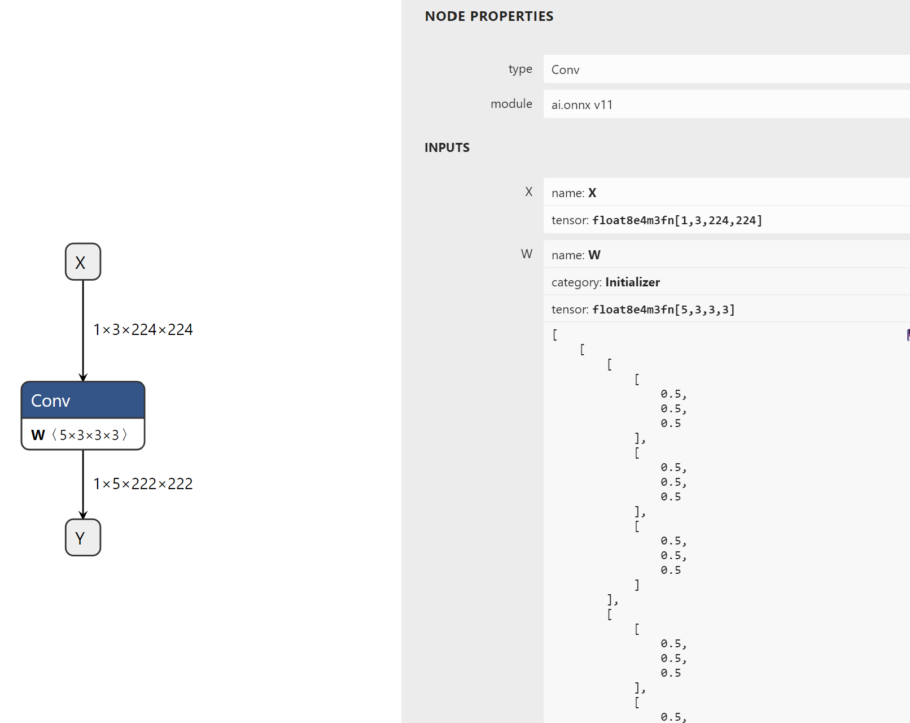

# Numpy Unsupported Dtypes

## Introduction

This example generates two models with `bfloat16` and `float8` weights respectively.

Currently `bfloat16` and `float8` aren't supported by numpy natively so data values are stored as float32 and the conversion happens prior to onnx export.

## BFloat16
```python
tensor = gs.Constant(name="weight", values=np.ones(shape=(5, 3, 3, 3), dtype=np.float32), export_dtype=onnx.TensorProto.BFLOAT16)
# or
tensor = gs.Constant(name="weight", values=np.ones(shape=(5, 3, 3, 3), dtype=np.float32))
tensor.export_dtype = onnx.TensorProto.BFLOAT16
```

## Float8E4M3
```python
tensor = gs.Constant(name="weight", values=np.ones(shape=(5, 3, 3, 3), dtype=np.float32), export_dtype=onnx.TensorProto.FLOAT8E4M3FN)
# or
tensor = gs.Constant(name="weight", values=np.ones(shape=(5, 3, 3, 3), dtype=np.float32))
tensor.export_dtype = onnx.TensorProto.FLOAT8E4M3FN
```

## Running the example

1. Generate the model:
    ```bash
    python3 generate.py
    ```

    This creates two models with bfloat16 and float8 weights respectively

    
    

