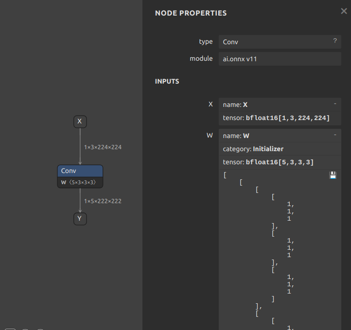
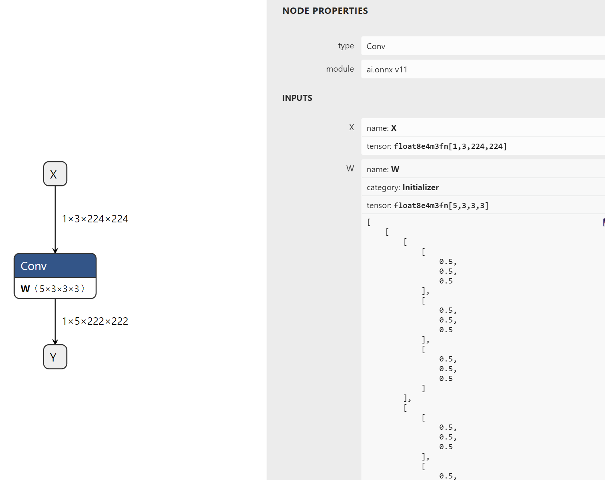

# Numpy Unsupported Dtypes

## Introduction

This example generates two models with `bfloat16` and `float8` weights respectively.

Currently `bfloat16` and `float8` aren't supported by numpy natively so we must use `ml_dtypes`.

## Running the example

1. Generate the model:
    ```bash
    python3 generate.py
    ```

    This creates two models with bfloat16 and float8 weights respectively

    
    
