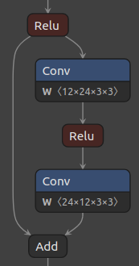
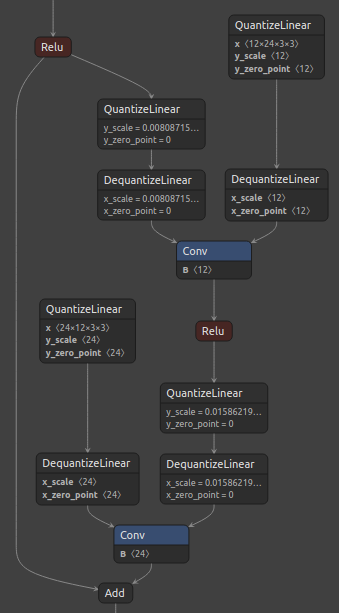
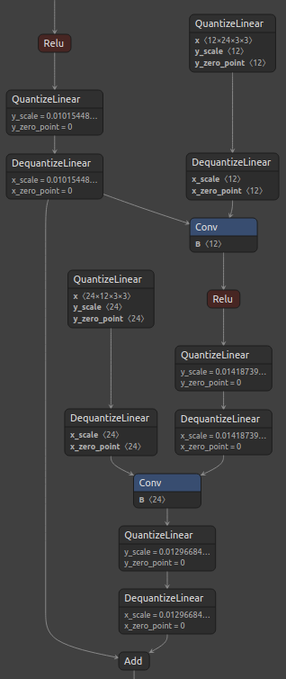
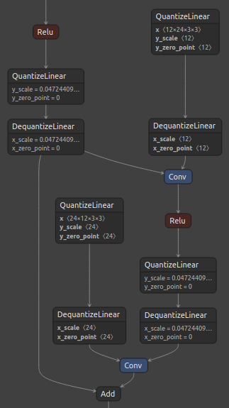

(custom_qdq_case)=

# **Add Custom QDQ Insertion Case**

This toolkit's default quantization behavior for each supported layer is displayed in the [Add New Layer Support](new_layer_support) section.

For the most part, it quantizes (adds Q/DQ nodes to) all inputs and weights (if the layer is weighted) of supported layers. However, the default behavior might not always lead to optimal INT8 fusions in TensorRT(TM). For example, Q/DQ nodes need to be added to residual connections in ResNet models. We provide a more in-depth explanation about this case in the "Custom Q/DQ Insertion Case Quantization" section later in this page.

To tackle those scenarios, we added the `Custom Q/DQ Insertion Case` library feature, which allows users to programmatically decide how a specific layer should be quantized differently in specific situations. Note that providing an object of `QuantizationSpec` class is a hard coded way of achieving the same goal.

Let's discuss the library-provided `ResNetV1QDQCase` to understand how passing custom Q/DQ insertion case objects affect Q/DQ insertion for the `Add` layer. 

## **Why is this needed?**

The main goal of the `Custom Q/DQ Insertion` feature is to twick the framework's behavior to meet network-specific quantization requirements. Let's check this through an example.

**Goal**: Perform custom quantization on a ResNet-like model. More specifically, we aim to quantize a model's residual connections.

We show three quantization scenarios: 1) default, 2) custom with `QuantizationSpec` (suboptimal), and 3) custom with `Custom Q/DQ Insertion Case` (optimal).

### **Default Quantization**
````{note}
Refer to **`Full Default Quantization`** [mode](basic).
````

The default quantization of the model is done with the following code snippet:

```python
# Quantize model
q_nn_model = quantize_model(model=nn_model_original)
```

Figure 1, below, shows the baseline ResNet residual block and its corresponding quantized block with the default quantization scheme.

<div align="center">  

 


Figure 1. ResNet residual block (left), and default quantized block (right).
</div>  

Notice that the default quantization behavior is to not add Q/DQ nodes before `Add` layers. Since `AddQuantizeWrapper`
 is already implemented in the toolkit, and just disabled by default, the simplest way to quantize that layer would be
 to enable quantization of layers of class type `Add`.

### **Custom Quantization with 'QuantizationSpec' (suboptimal)**
````{note}
Refer to **`Full Custom Quantization`** [mode](basic).
````

The following code snippet enables quantization of all layers of class type `Add`:

```python
# 1. Enable `Add` layer quantization
qspec = QuantizationSpec()
qspec.add(name='Add', is_keras_class=True)

# 2. Quantize model
q_nn_model = quantize_model(
    model=nn_model_original, quantization_spec=qspec
)
```

Figure 2, below, shows the standard ResNet residual block and its corresponding quantized block with the suggested custom quantization.

<div align="center">  

 


Figure 2. ResNet residual block (left), and Q/DQ node insertion for `Add` layer passed via `QuantizationSpec` (right).
</div>  

Notice that all inputs of the `Add` layer were quantized. However, that still does not enable optimal [layer fusions in TensorRT(TM)](https://docs.nvidia.com/deeplearning/tensorrt/developer-guide/index.html#enable-fusion), where a Convolution layer followed by an ElementWise layer (such as `Add`) can be fused into a single Convolution kernel.
 The [recommendation](https://docs.nvidia.com/deeplearning/tensorrt/developer-guide/index.html#qdq-placement-recs__xxx), in this case, is to add Q/DQ nodes in the residual connection only (not between `Add` and `Conv`).

### **Custom Quantization with 'Custom Q/DQ Insertion Case' (optimal)**
````{note}
Refer to **`Full Custom Quantization`** [mode](basic).
````

The library-provided `ResNetV1QDQCase` class solves this issue by programming `Add` layer class to skip Q/DQ in one path if that path connects to `Conv`.
 This time, we pass an object of `ResNetV1QDQCase` class to the `quantize_model` function:

```python
# 1. Indicate one or more custom QDQ cases 
custom_qdq_case = ResNetV1QDQCase()

# 3. Quantize model
q_nn_model = quantize_model(
    model=nn_model_original, custom_qdq_cases=[custom_qdq_case]
)
```

Figure 3, below, shows the standard ResNet residual block and its corresponding quantized block with the suggested custom quantization.

<div align="center"> 




Figure 3. ResNet residual block (left), and Q/DQ node insertion for `Add` layer passed via `ResNetV1QDQCase` (right).
</div>

Notice that Q/DQ nodes are not added to the path coming from `Conv` layer. Additionally, since both outputs of the first `Relu` layer were quantized, it was possible to perform a horizontal fusion with them, resulting in only one pair of Q/DQ nodes at that location.
 This quantization approach leads to an optimal graph for TensorRT INT8 fusions.

## **Library provided custom Q/DQ insertion cases**

We provide custom Q/DQ insertion cases for the models available in the model zoo. The library-provided custom Q/DQ insertion case classes can be imported from `tensorflow_quantization.custom_qdq_cases` module and passed to the `quantize_model` function.

```{note}
Refer to [tensorflow_quantization.custom_qdq_cases](https://gitlab-master.nvidia.com/TensorRT/Tools/tensorflow-quantization/-/blob/main/tensorflow_quantization/custom_qdq_cases.py) module for more details.
```

## **How to add a new custom Q/DQ insertion case?**

```{eval-rst}

#. Create a new class by inheriting ``tensorflow_quantization.CustomQDQInsertionCase`` class.
#. Override two methods:

    1. ``case`` (compulsory) 
    
    This method has fixed signature as shown below. Library automatically calls ``case`` method of all members of ``custom_qdq_cases`` parameter inside ``quantize_model`` function. Logic for changing the default layer behavior should be encoded in this function and an object of ``QuantizationSpec`` class must be returned.

    .. code-block:: python

        (function)CustomQDQInsertionCase.case(
            self, 
            keras_model : 'tf.keras.Model', 
            qspec : 'QuantizationSpec'
        ) -> 'QuantizationSpec'


    2. ``info`` (optional)  
    
    This is just a helper method explaining the logic inside ``case`` method.

#. Add object of this new class to a list and pass it to the ``custom_qdq_cases`` parameter of the ``quantize_model`` function.

```

```{eval-rst}
.. ATTENTION::

    If ``CustomQDQInsertionCase`` is written, ``QuantizationSpec`` object MUST be returned.

```

Example,

```python
class MaxPoolQDQCase(CustomQDQInsertionCase):
    def __init__(self) -> None:
        super().__init__()

    def info(self) -> str:
        return "Enables quantization of MaxPool layers."

    def case(
        self, keras_model: tf.keras.Model, qspec: QuantizationSpec
    ) -> QuantizationSpec:
        mp_qspec = QuantizationSpec()
        for layer in keras_model.layers:
            if isinstance(layer, tf.keras.layers.MaxPooling2D):
                if check_is_quantizable_by_layer_name(qspec, layer.name):
                    mp_qspec.add(
                        name=layer.name,
                        quantize_input=True,
                        quantize_weight=False
                    )
        return mp_qspec
```

As shown in the above MaxPool custom Q/DQ case class, the `case` method needs to be overridden. The optional `info` method returns a short description string.

The logic written in the `case` method might or might not use the user-provided `QuantizationSpec` object, but it MUST return a new `QuantizationSpec` which holds information on the updated layer behavior. In the `MaxPoolQDQCase` case above, the custom Q/DQ insertion logic is dependent of the user-provided `QuantizationSpec` object (`check_is_quantizable_by_layer_name` checks if the layer name is in the user-provided object and gives priority to that specification).
