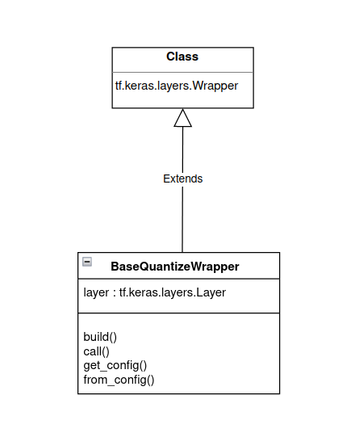
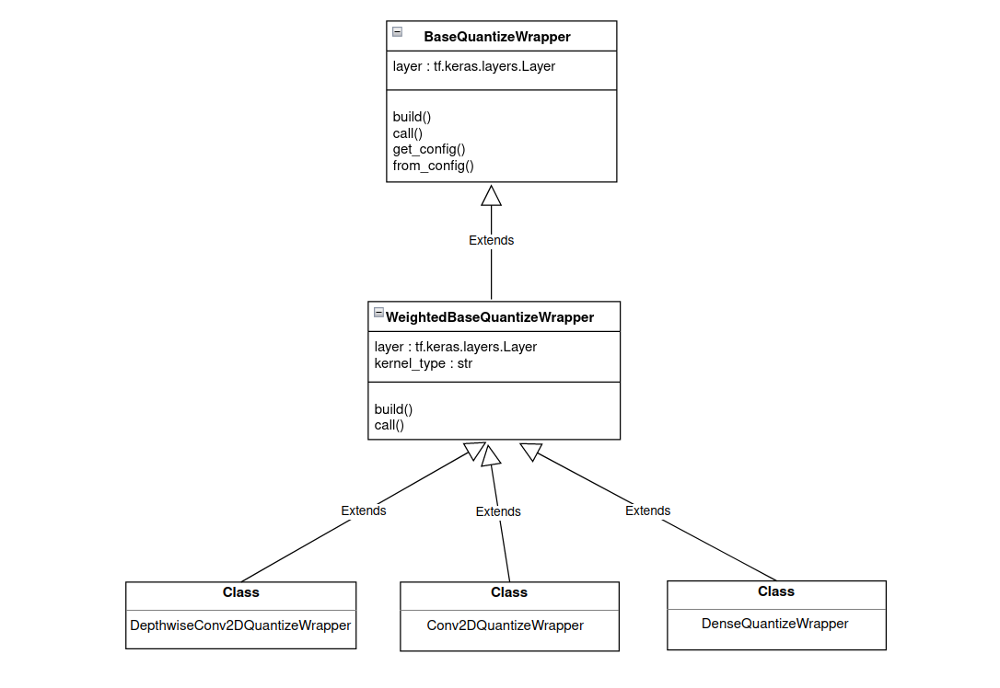
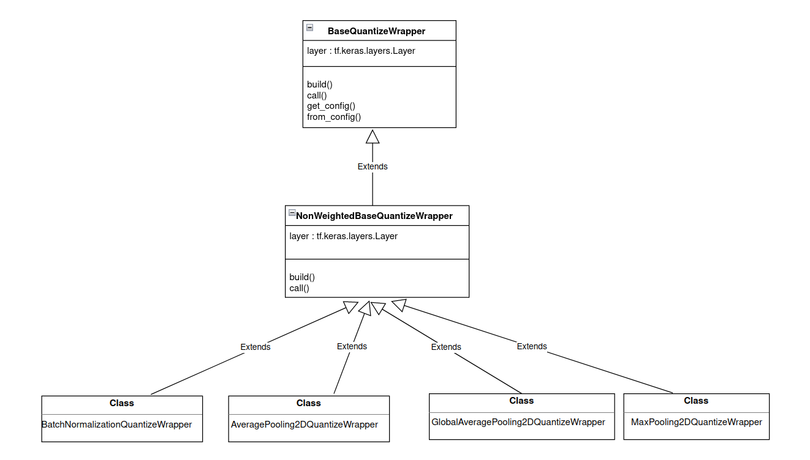
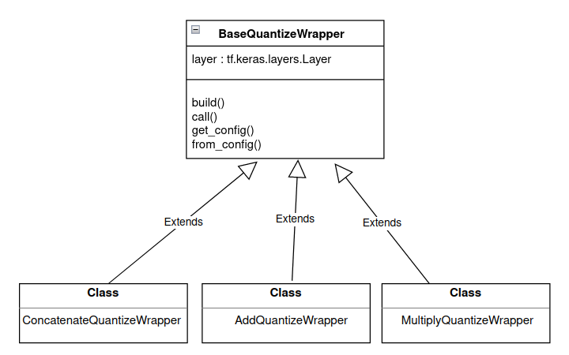

(new_layer_support)=

# **Add New Layer Support**

This toolkit uses a TensorFlow Keras [wrapper layer](https://www.tensorflow.org/api_docs/python/tf/keras/layers/Wrapper) to insert QDQ nodes before quantizable layers.

## **Supported Layers**

The following matrix shows the layers supported by this toolkit and their default behavior:

| **Layer**                                 | **Quantize Input** | **Quantize Weight** | **Quantization Indices** |
|-------------------------------------------|--------------------|---------------------|--------------------------|
| tf.keras.layers.Conv2D                    | True               | True                | -                        |
| tf.keras.layers.Dense                     | True               | True                | -                        |
| tf.keras.layers.DepthwiseConv2D           | True               | True                | -                        |
| tf.keras.layers.AveragePooling2D          | True               | -                   | -                        |
| tf.keras.layers.GlobalAveragePooling2D    | True               | -                   | -                        |
| tf.keras.layers.MaxPooling2D              | False*             | -                   | -                        |
| tf.keras.layers.BatchNormalization        | False*             | -                   | -                        |
| tf.keras.layers.Concatenate               | False*             | -                   | None*                    |
| tf.keras.layers.Add                       | False*             | -                   | None*                    |
| tf.keras.layers.Multiply                  | False*             | -                   | None*                    |

```{note}
*Inputs are not quantized by default. However, quantization is possible by passing those layers as `QuantizationSpec` to `quantize_model()`. Alternatively, fine-grained control over the layer's behavior can also be achieved by implementing a [Custom QDQ Insertion Case](custom_qdq_case).

Note that the set of layers to be quantized can be network dependent. For example, `MaxPool` layers need not be quantized in ResNet-v1, but ResNet-v2 requires them to be quantized due to their location in residual connections. This toolkit, thus, offers flexibility to quantize any layer as needed.  

``` 

## **How are wrappers developed?**
`BaseQuantizeWrapper` is a core quantization class which is inherited from `tf.keras.layers.Wrapper` keras wrapper class as shown in Figure 1 below.  

<div align="center">

  

Figure 1. BaseQuantizeWrapper inheritance.
</div>


All quantization wrappers are derived from `BaseQuantizeWrapper` class. Each wrapper takes *`layer(tf.keras.layers.Layer)`* as an argument which is handled by the toolkit internally. To simplify the development process, layers are classified as weighted, non-weighted, or other type.

**Weighted Layers**

Weighted layers are inherited from `WeightedBaseQuantizeWrapper` class which itself is inherited from `BaseQuantizeWrapper`, as shown in Figure 2 below. *`layer`* argument to `WeightedBaseQuantizeWrapper` class is handled by the library, however, *`kernel_type`* argument must be selected while developing wrapper. *`kernel_type`* for weighted layer gives access to layer weights.

<div align="center">

  

Figure 2. Inheritance flow for weighted layers.  
</div>


**Non-weighted Layers**

Weighted layers are inherited from `WeightedBaseQuantizeWrapper` class which itself is inherited from `BaseQuantizeWrapper` as shown in Figure 3 below. *`layer`* argument to `WeightedBaseQuantizeWrapper` class is handled by the library.

<div align="center">

  

Figure 3. Inheritance flow for non-weighted layers. 
</div>


**Other Layers**
Other layers are inherited from `BaseQuantizeWrapper` directly, as shown in Figure 4 below.

<div align="center">

  

Figure 4. Inheritance flow for other layers. 
</div>

## **How to add a new wrapper?**  

```{eval-rst}

#. Study current wrappers from ``tensorflow_quantization/quantize_wrappers.py`` script.
#. Create a new class by inheriting one of ``BaseQuantizeWrapper``, ``WeightedBaseQuantizeWrapper`` or ``NonWeightedBaseQuantizeWrapper`` classes based on new layer type.
#. Update ``build`` and ``call`` methods based upon layer behavior.

.. ATTENTION::

    New class will automatically get registered only if toolkit naming conventions are followed. For a keras layer ``l``, class name must be ``<l.__class__.__name__>QuantizeWrapper``.


``` 

## **Example**

Let's see how support for a new Keras layer [GlobalMaxPool2D](https://www.tensorflow.org/api_docs/python/tf/keras/layers/GlobalMaxPool2D) can be added.

This is a non-weighted layer thus we will inherit `NonWeightedBaseQuantizeWrapper`.

Following toolkit naming conventions, this new wrapper should be named `GlobalMaxPool2DQuantizeWrapper`.

```python

from tensorflow_quantization import NonWeightedBaseQuantizeWrapper

class GlobalMaxPool2DQuantizeWrapper(NonWeightedBaseQuantizeWrapper):
    
    def __init__(self, layer, **kwargs):
        """
        Creates a wrapper to emulate quantization for the GlobalMaxPool2D keras layer.
        Args:
        layer: The keras layer to be quantized.
        **kwargs: Additional keyword arguments to be passed to the keras layer.
        """
        super().__init__(layer, **kwargs)

    def build(self, input_shape):
        super().build(input_shape)

    def call(self, inputs, training=None):
        return super().call(inputs, training=training)

```

This new wrapper class is the same as the existing `GlobalAveragePooling2D`, `AveragePooling2D`, and `MaxPool2D` wrapper classes found in `tensorflow_quantization/quantize_wrappers.py`.

```{eval-rst}

.. ATTENTION::

    New Class registration is based on tracking child classes of ``BaseQuantizeWrapper`` parent class. Thus, new class won't get registered unless explicitly called (this is current restriction).

    To make sure new wrapper class is registered,
    
    #. If new wrapper class is defined in a separate module, import it in the module where ``quantize_model`` function is called.

    #. If new wrapper class if defined in the same module as ``quantize_model`` function, create object of this new class. You don't have to pass that object anywhere.  
```
