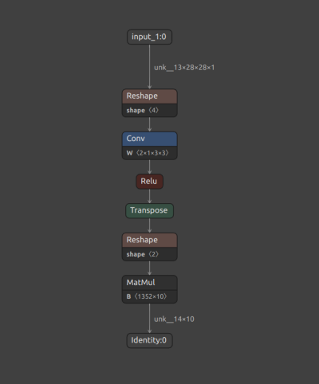
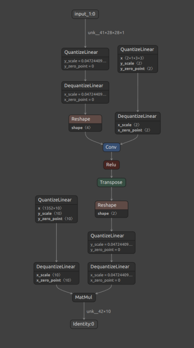

(basic)=

```{eval-rst}

.. admonition:: Attention
    :class: attention

    #. This toolkit supports only Quantization Aware Training (QAT) as a quantization method.
    #. Subclassed models are not supported in the current version of this toolkit. Original Keras layers are wrapped into quantized layers using TensorFlow's `clone_model <https://www.tensorflow.org/api_docs/python/tf/keras/models/clone_model>`_ method, which doesn't support subclassed models.

```

# **Basics**

## Quantization Function

`quantize_model` is the only function the user needs to quantize any Keras model. It has the following signature:

```python
(function) quantize_model:
(
    model: tf.keras.Model,
    quantization_mode: str = "full",
    quantization_spec: QuantizationSpec = None,
    custom_qdq_cases : List['CustomQDQInsertionCase'] = None
) -> tf.keras.Model
```

````{note}
Refer to the [Python API](qmodel_api) for more details.
````

Example

```{eval-rst}
.. code-block:: python
    :emphasize-lines: 23

    import tensorflow as tf
    from tensorflow_quantization import quantize_model, utils

    assets = utils.CreateAssetsFolders("toolkit_basics")
    assets.add_folder("example")

    # 1. Create a simple model (baseline)
    input_img = tf.keras.layers.Input(shape=(28, 28, 1))
    x = tf.keras.layers.Conv2D(filters=2, kernel_size=(3, 3))(input_img)
    x = tf.keras.layers.ReLU()(x)
    x = tf.keras.layers.Flatten()(x)
    x = tf.keras.layers.Dense(10)(x)
    model = tf.keras.Model(input_img, x)

    # 2. Train model
    model.fit(train_images, train_labels, batch_size=32, epochs=2, validation_split=0.1)

    # 3. Save model and then convert it to ONNX
    tf.keras.models.save_model(model, assets.example.fp32_saved_model)
    utils.convert_saved_model_to_onnx(assets.example.fp32_saved_model, assets.example.fp32_onnx_model)

    # 4. Quantize the model
    q_model = quantize_model(model)

    # 5. Train quantized model again for a few epochs to recover accuracy (fine-tuning).
    q_model.fit(train_images, train_labels, batch_size=32, epochs=2, validation_split=0.1)
    
    # 6. Save the quantized model with QDQ nodes inserted and then convert it to ONNX
    tf.keras.models.save_model(q_model, assets.example.int8_saved_model)
    utils.convert_saved_model_to_onnx(assets.example.int8_saved_model, assets.example.int8_onnx_model)

```

````{note}
The quantized model `q_model` behaves similar to the original [Keras model](https://www.tensorflow.org/api_docs/python/tf/keras/Model), meaning that the `compile()` and `fit()` functions can also be used to easily fine-tune the model.
Refer to [Getting Started: End to End](GS_ETE) for more details.
````

Saved ONNX files can be visualized with [Netron](https://netron.app/). Figure 1, below, shows a snapshot of the original FP32 baseline model.

<div align="center">



Figure 1. Original FP32 model.
</div>

The quantization process inserts [Q/DQ](https://www.tensorflow.org/api_docs/python/tf/quantization/quantize_and_dequantize_v2)
 nodes at the inputs and weights (if layer is weighted) of all supported layers, according to the TensorRT(TM) quantization 
 [policy](https://docs.nvidia.com/deeplearning/tensorrt/developer-guide/index.html#work-with-qat-networks). 
 The presence of a Quantize node (`QuantizeLinear` ONNX op), followed by a Dequantize node (`DequantizeLinear` ONNX op), 
 for each supported layer, can be verified in the Netron visualization in Figure 2 below.

<div align="center">



Figure 2. Quantized INT8 model.
</div>

TensorRT(TM) converts ONNX models with Q/DQ nodes into an INT8 [engine](https://docs.nvidia.com/deeplearning/tensorrt/developer-guide/index.html#prog-model), which can take advantage of [Tensor Cores](https://www.nvidia.com/en-us/data-center/tensor-cores/) and other hardware accelerations in the latest NVIDIA(R) GPUs.

## Quantization Modes

There are a few scenarios where one might need to customize the default quantization scheme.
 We broadly categorize quantization (i.e. the process of adding Q/DQ nodes) into `Full` and `Partial` modes, depending on the set of layers that are quantized.
 Additionally, Full quantization can be `Default` or `Custom`, while Partial quantization is always `Custom`.

```{eval-rst}

#. Full Default Quantization
    All supported layers of a given model are quantized as per default toolkit behavior.
#. Full Custom Quantization
    Toolkit behavior can be programmed to quantize specific layers differentely by passing an object of ``QuantizationSpec`` class and/or ``CustomQDQInsertionCase`` class. The remaining supported layers are quantized as per `default behavior <new_layer_support>`_. 
#. Partial Quantization
    Only layers passed using ``QuantizationSpec`` and/or ``CustomQDQInsertionCase`` class object are quantized.
```

```{note}
Refer to the [Tutorials](tut_one) for examples on each mode.
```

## Terminologies

### Layer Name 

Name of the Keras layer either assigned by the user or Keras. These are unique by default.

```python
import tensorflow as tf
l = tf.keras.layers.Dense(units=100, name='my_dense')
```

Here ‘my_dense’ is a layer name assigned by the user.

```{tip}
For a given layer `l`, the layer name can be found using `l.name`.
```

### Layer Class

Name of the Keras layer class.

```python
import tensorflow as tf
l = tf.keras.layers.Dense(units=100, name='my_dense')
```

Here ‘Dense’ is the layer class.

```{tip}
For a given layer `l`, the layer class can be found using `l.__class__.__name__` or `l.__class__.__module__`.
```

## NVIDIA(R) vs TensorFlow Toolkit

[TFMOT](https://www.tensorflow.org/model_optimization/api_docs/python/tfmot) is TensorFlow's official quantization toolkit. The quantization recipe used by TFMOT is different to NVIDIA(R)'s in terms of Q/DQ nodes placement, and it is optimized for TFLite inference. The NVIDIA(R) quantization recipe, on the other hand, is optimized for TensorRT(TM), which leads to optimal model acceleration on NVIDIA(R) GPUs and hardware accelerators.

Other differences:

| Feature                     | TensorFlow Model Optimization Toolkit (TFMOT)                  | NVIDIA(R) Toolkit                                                                                                                         |
|-----------------------------|----------------------------------------------------------------|-------------------------------------------------------------------------------------------------------------------------------------------|
| QDQ node placements         | Outputs and Weights                                            | Inputs and Weights                                                                                                                        |
| Quantization support        | Whole model (full) and of some layers (partial by layer class) | Extends TF quantization support: partial quantization by layer name and pattern-base quantization by extending `CustomQDQInsertionCase`   |
| Quantization scheme         | `tf.quantization.fake_quant_with_min_max_vars`                 | `tf.quantization.quantize_and_dequantize_v2`                                                                                              |


## Additional Resources
**About this toolkit**
- [GTC 2022 Tech Talk](https://www.nvidia.com/en-us/on-demand/session/gtcspring22-s41440/) (NVIDIA)

**Blogs**
- [Achieving FP32 Accuracy for INT8 Inference Using Quantization Aware Training with NVIDIA TensorRT](https://developer.nvidia.com/blog/achieving-fp32-accuracy-for-int8-inference-using-quantization-aware-training-with-tensorrt/) (NVIDIA)
- [Speeding Up Deep Learning Inference Using TensorFlow, ONNX, and NVIDIA TensorRT](https://developer.nvidia.com/blog/speeding-up-deep-learning-inference-using-tensorflow-onnx-and-tensorrt/) (NVIDIA)
- [Why are Eight Bits Enough for Deep Neural Networks?](https://petewarden.com/2015/05/23/why-are-eight-bits-enough-for-deep-neural-networks/)
- [What I’ve learned about Neural Network Quantization](https://petewarden.com/2017/06/22/what-ive-learned-about-neural-network-quantization/)

**Videos**
- [Inference and Quantization](https://www.youtube.com/watch?v=VsGX9kFXjbs)
- [8-bit Inference with TensorRT Webinar](http://on-demand.gputechconf.com/gtcdc/2017/video/DC7172/)

**Generate per-tensor dynamic range**
- [Setting Per-Tensor Dynamic Range Using C++](https://docs.nvidia.com/deeplearning/sdk/tensorrt-developer-guide/index.html#set_tensor_mp_c) (NVIDIA)
- [Quantization and Training of Neural Networks for Efficient Integer-Arithmetic-Only Inference](https://arxiv.org/pdf/1712.05877.pdf)
- [Quantizing Deep Convolutional Networks for Efficient Inference: A Whitepaper](https://arxiv.org/pdf/1806.08342.pdf)
- [8-bit Inference with TensorRT](http://on-demand.gputechconf.com/gtc/2017/presentation/s7310-8-bit-inference-with-tensorrt.pdf) (NVIDIA)

**Documentation** (NVIDIA)
- [Introduction to NVIDIA’s TensorRT Samples](https://docs.nvidia.com/deeplearning/sdk/tensorrt-sample-support-guide/index.html#samples)
- [Working with TensorRT Using the C++ API](https://docs.nvidia.com/deeplearning/sdk/tensorrt-developer-guide/index.html#c_topics)
- [NVIDIA’s TensorRT Documentation Library](https://docs.nvidia.com/deeplearning/sdk/tensorrt-archived/index.html)
- [Working with INT8 in TensorRT](https://docs.nvidia.com/deeplearning/tensorrt/developer-guide/index.html#working-with-int8)
